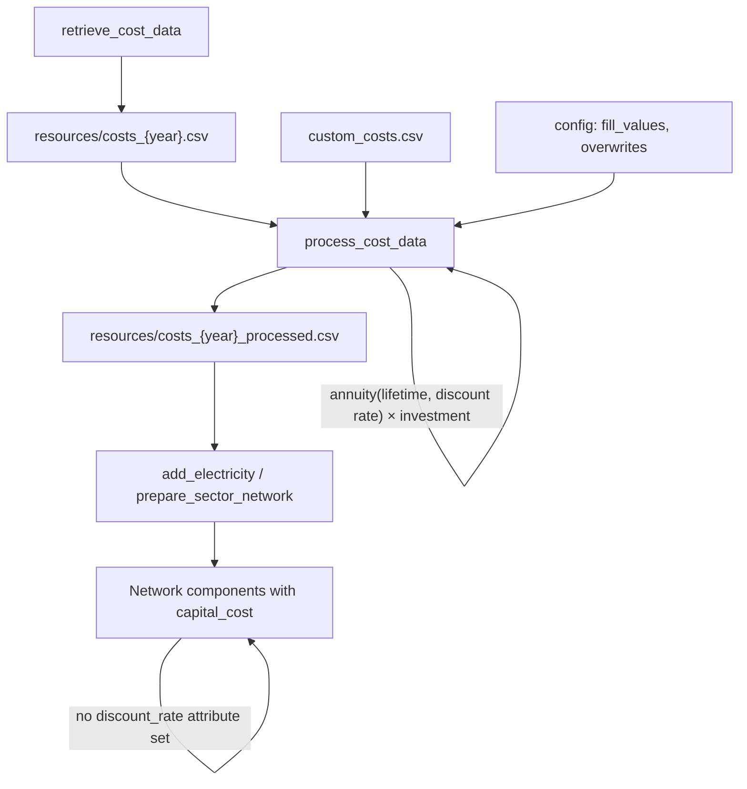

# Discount rates in PyPSA-Wal

This note reviews how **financial discount rates** (WACC) and **social discount rates** are used in PyPSA-Wal (a soft-fork of PyPSA-Eur / PyPSA-Eur-Sec), based on the configuration files, cost pipeline, and source code. It answers whether different technologies can have different discount rates, what is already supported, and what it would take to extend the workflow.

Default values below come from `config/config.default.yaml` plus `config/config.walloon.yaml` overrides where noted. Cost assumptions are from **PyPSA `technology-data` v0.13.3** (`costs.year: 2050`), processed by `scripts/process_cost_data.py`.

---

## 1. Scope and vocabulary

Two distinct discount-rate concepts appear in the workflow. They must not be conflated.

| Concept | Config key | Default | Purpose |
|---------|------------|---------|---------|
| **Financial discount rate** (WACC) | `costs.fill_values."discount rate"` | **7%** | Annualise overnight CAPEX into `capital_cost` (€/MW/a) |
| **Social discount rate** | `costs.social_discountrate` | **2%** | Weight costs across investment periods in perfect-foresight runs |

The financial rate reflects **project financing** (cost of capital over an asset's economic lifetime). The social rate reflects **societal time preference** when comparing welfare across planning horizons — it is not technology-specific and is unrelated to WACC.

PyPSA-Wal does **not** propagate `discount_rate` onto network components. Instead, the financial discount rate is applied **upstream** when building the processed cost table; components receive pre-annualised `capital_cost` values.

---

## 2. End-to-end cost workflow



### 2.1 Technology data (`scripts/retrieve_cost_data.py`)

Cost assumptions are downloaded from the [PyPSA/technology-data](https://github.com/PyPSA/technology-data) repository. Each technology can have multiple parameters, including an optional **`discount rate`** row alongside `investment`, `lifetime`, `FOM`, `VOM`, etc.

In **technology-data v0.13.3** (`costs_2050.csv`), only **8 technologies** carry an explicit discount rate:

| Technology | Discount rate |
|------------|---------------|
| decentral CHP | 4% |
| decentral air-sourced heat pump | 4% |
| decentral gas boiler | 4% |
| decentral ground-sourced heat pump | 4% |
| decentral resistive heater | 4% |
| decentral solar thermal | 4% |
| decentral water tank storage | 4% |
| solar-rooftop | 4% |

All other technologies rely on the config fill value (**7%**) when `process_cost_data` runs.

### 2.2 Cost preparation (`scripts/process_cost_data.py`)

The function `prepare_costs()` is the central place where financial discount rates affect optimisation inputs:

1. Raw cost CSV is unpivoted to one row per technology.
2. Custom cost overrides are applied (`data/custom_costs.csv` or the Walloon variant `data/walloon/custom_costs_rc.csv`).
3. Missing parameters are filled from `costs.fill_values` in config (including `"discount rate": 0.07`).
4. **`capital_cost`** is computed per technology:

   \[
   \text{capital\_cost} = \bigl(\text{annuity}(\text{lifetime}, r) + \text{FOM}/100\bigr) \times \text{investment} \times N_{\text{years}}
   \]

   where \(r\) is the per-technology `discount rate` column.

5. Processed costs are written to `resources/costs_{planning_horizons}_processed.csv`.

The annuity helper in `scripts/add_electricity.py` already accepts a **pandas Series** of rates, so different technologies are annualised in a single vectorised pass:

```python
annuity_factor = calculate_annuity(costs["lifetime"], costs["discount rate"])
```

### 2.3 Network assignment (`scripts/add_electricity.py`, `scripts/prepare_sector_network.py`)

When components are added to the PyPSA network, the workflow sets:

- `capital_cost` — pre-annualised fixed cost used in the objective
- `lifetime` — used for asset decommissioning / brownfield logic
- **not** `discount_rate`, `overnight_cost`, or `fom_cost`

Example from existing-generator addition:

```python
n.add(
    "Generator", ...,
    capital_cost=ppl.capital_cost,
    lifetime=ppl.lifetime,
)
```

The optimiser therefore sees only the final `capital_cost`; the discount rate that produced it is not stored on the component.

### 2.4 Social discount rate (`scripts/prepare_perfect_foresight.py`)

For **perfect-foresight** multi-period runs, a single global `costs.social_discountrate` (default 2%) defines `investment_period_weightings` when concatenating networks across planning horizons. Functions `get_social_discount()` and `get_investment_weighting()` apply \(1/(1+r)^t\) weighting.

This rate is used in post-processing summaries (`scripts/make_summary_perfect.py`, `scripts/make_cumulative_costs.py`) to express future-period costs in present-value terms of the first planning horizon. It does **not** enter the per-technology CAPEX annualisation in `process_cost_data`.

The wildcard option `sdr+XX` (parsed in `scripts/_helpers.py`) overrides `social_discountrate` at runtime (e.g. `sdr+3` → 3%).

---

## 3. What PyPSA core supports

Modern PyPSA (≥ 1.1) supports **two equivalent ways** to specify investment costs on each component row:

| Approach | Attributes | Who annualises |
|----------|------------|----------------|
| **Pre-annualised (default in tutorials)** | `capital_cost` | User / workflow |
| **Overnight + financing parameters** | `overnight_cost`, `discount_rate`, `lifetime`, optional `fom_cost` | PyPSA via `pypsa.costs.periodized_cost()` |

In the second approach, each generator, link, store, line, etc. can have its **own** `discount_rate`. PyPSA computes:

\[
c = c_{\text{overnight}} \cdot \text{annuity}(r, n) \cdot N_{\text{years}} + c_{\text{fom}}
\]

**PyPSA-Wal uses only the first approach.** This is consistent with the PyPSA-Eur design pattern but means discount rates are implicit in `capital_cost` rather than explicit on the network object.

---

## 4. Current behaviour summary

| Question | Answer |
|----------|--------|
| Can different technologies have different **financial** discount rates? | **Yes** — via technology-data rows and/or `custom_costs.csv` overrides before `process_cost_data`. |
| Are different rates used by default? | **Mostly no** — 7% fill value for almost all technologies; 4% only for 8 decentral/residential entries in technology-data v0.13.3. |
| Does PyPSA store per-component `discount_rate` in this workflow? | **No** — only `capital_cost` is assigned. |
| Can different technologies have different **social** discount rates? | **No** — single global `social_discountrate`; not supported by PyPSA or this workflow. |
| Does changing `fill_values."discount rate"` affect already-processed costs? | Only after re-running `process_cost_data` (and downstream network rules). |

---

## 5. How to set per-technology financial discount rates (no code changes)

Add rows to `data/custom_costs.csv` (or `data/walloon/custom_costs_rc.csv` when referenced in config):

```csv
planning_horizon,technology,parameter,value,unit,source,further description
all,onwind,discount rate,0.05,per unit,Custom WACC assumption,
all,nuclear,discount rate,0.08,per unit,Custom WACC assumption,
all,solar,discount rate,0.04,per unit,Custom WACC assumption,
```

Rules:

- `planning_horizon: all` applies to every investment period; a specific year (e.g. `2050`) overrides only that horizon.
- `technology: all` propagates one value to **every** technology (use with care).
- `discount rate` is treated as a **raw attribute** — applied **before** `capital_cost` is computed, so you should not also override `capital_cost` for the same technology unless you intend to bypass the annuity calculation entirely.

After editing, re-run the Snakemake cost and network preparation rules so processed costs and component `capital_cost` values are refreshed.

To change the default for all technologies without explicit overrides, edit:

```yaml
costs:
  fill_values:
    "discount rate": 0.07   # change this scalar
```

---

## 6. Known limitations and edge cases

### 6.1 Hardcoded global rate in enhanced geothermal (EGS)

`scripts/prepare_sector_network.py` → `add_enhanced_geothermal()` reads the **global fill value** instead of the geothermal row from the processed cost table:

```python
dr = costs_config["fill_values"]["discount rate"]
egs_annuity = calculate_annuity(lt, dr)
orc_annuity = calculate_annuity(costs.at["organic rankine cycle", "lifetime"], dr)
```

If per-technology discount rates are introduced for geothermal or ORC, this function should be updated to use e.g. `costs.at["geothermal", "discount rate"]` — a **small, local fix**.

### 6.2 Deprecated config overwrites

`costs.overwrites` in config can still overwrite raw attributes (including `"discount rate"`) per technology, but this path emits deprecation warnings; **`custom_costs.csv` is the supported mechanism**.

### 6.3 Direct `capital_cost` overrides

If `capital_cost` is set directly in `custom_costs.csv`, it bypasses the annuity calculation entirely. Any `discount rate` entry for the same technology is then irrelevant for that component's fixed cost.

### 6.4 Brownfield / lifetime logic

`lifetime` is stored on components and used for decommissioning schedules (`scripts/add_brownfield.py`, `scripts/add_existing_baseyear.py`). Changing `discount rate` affects **new** investment economics via `capital_cost` but does not automatically change lifetime or existing-asset treatment.

---

## 7. Extension options and complexity

| Goal | Complexity | What to change |
|------|------------|----------------|
| **Different WACC per technology (recommended)** | **Low** | Add `discount rate` rows in `custom_costs.csv`; re-run cost pipeline. Infrastructure already exists. |
| **Change default WACC for all unspecified techs** | **Trivial** | Edit `costs.fill_values."discount rate"` in config. |
| **Fix EGS hardcoded global rate** | **Low** | ~2 lines in `add_enhanced_geothermal()` to read per-tech rate from `costs`. |
| **Switch to PyPSA-native `discount_rate` on components** | **Medium–high** | Refactor `add_electricity.py`, `prepare_sector_network.py`, and related scripts to pass `overnight_cost` + `discount_rate` + `lifetime` (+ `fom_cost`) instead of pre-computed `capital_cost`. Benefit: audit trail on the network object and PyPSA re-annualises if `nyears` changes. |
| **Per-technology social discount rates** | **High / non-standard** | Would require a custom objective or post-processing; not supported by PyPSA; uncommon in energy-system models. |
| **Time-varying WACC by planning horizon** | **Low–medium** | Add horizon-specific rows in `custom_costs.csv` (supported by the `planning_horizon` column); no code changes if technologies differ by year only. |

---

## 8. Relation to other cost documentation

- **`doc/costs.rst`** — describes technology-data sources and the annuity formula used for `capital_cost`.
- **`docs/network-representation-analysis.md` §4** — lists grid investment costs annualised at **7%**, **40-year lifetime**, **2%/a FOM** as the default assumption for transmission and distribution components.
- **`config/config.walloon.yaml`** — points `costs.custom_cost_fn` to `data/walloon/custom_costs_rc.csv` for fuels and selected technologies; grid cost rows are not overridden there, so grid technologies follow the global 7% fill value unless added explicitly.

---

## 9. Key code locations

| Topic | File |
|-------|------|
| Annuity calculation | `scripts/add_electricity.py` → `calculate_annuity()` |
| Cost processing & per-tech discount column | `scripts/process_cost_data.py` → `prepare_costs()` |
| Custom cost overrides | `data/custom_costs.csv`, `data/walloon/custom_costs_rc.csv` |
| Default & social discount config | `config/config.default.yaml` → `costs:` |
| Technology-data download | `scripts/retrieve_cost_data.py` |
| Generator / link cost assignment | `scripts/add_electricity.py`, `scripts/prepare_sector_network.py` |
| EGS hardcoded global rate | `scripts/prepare_sector_network.py` → `add_enhanced_geothermal()` |
| Perfect-foresight social discount | `scripts/prepare_perfect_foresight.py` |
| Wildcard `sdr+XX` override | `scripts/_helpers.py` |
| Cost documentation | `doc/costs.rst`, `doc/configtables/costs.csv` |

---

## 10. Bottom line

- **PyPSA core** supports per-component `discount_rate` when using the `overnight_cost` API; **PyPSA-Wal does not use that path** and instead bakes financing assumptions into `capital_cost` during `process_cost_data`.

- **Per-technology financial discount rates are already supported** in the cost pipeline: `prepare_costs()` annualises each technology with its own `discount rate` column, and `calculate_annuity()` handles vectorised rates. In practice, almost all technologies share the **7% default**; only eight decentral/residential technologies in technology-data v0.13.3 specify **4%**.

- **Setting different WACC per technology requires no code changes** — add `discount rate` entries to `custom_costs.csv` (or the Walloon custom costs file) and re-run the cost and network rules.

- **Social discount rate** (`social_discountrate`, default 2%) is a **single global** parameter for multi-period welfare weighting and is separate from technology financing.

- The main gap for full per-technology consistency is the **EGS cost function**, which still reads the global fill value; switching to PyPSA-native component-level `discount_rate` attributes would be a broader refactor with moderate effort but clearer traceability on the network object.
