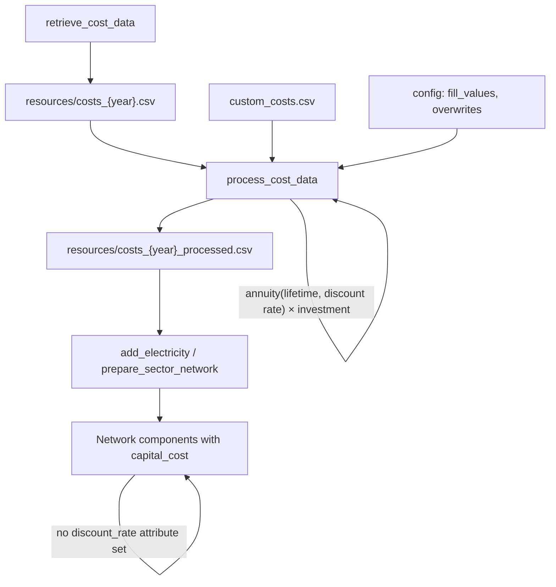
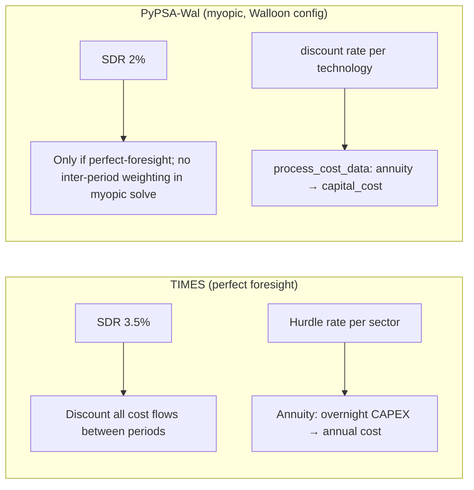

# Discount rates in PyPSA-Wal

This note reviews how **financial discount rates** (WACC / hurdle rates) and **social discount rates** are used in PyPSA-Wal (a soft-fork of PyPSA-Eur / PyPSA-Eur-Sec), based on the configuration files, cost pipeline, and source code. It also summarises harmonisation discussions with the **TIMES** demand model (§9). It answers whether different technologies can have different discount rates, what is already supported, and what it would take to extend the workflow.

Default values below come from `config/config.default.yaml` plus `config/config.walloon.yaml` overrides where noted. Cost assumptions are from **PyPSA `technology-data` v0.13.3** (`costs.year: 2050`), processed by `scripts/process_cost_data.py`.

---

## 1. Scope and vocabulary

Two distinct discount-rate concepts appear in the workflow. They must not be conflated.

| Concept | Config key | Default | Purpose |
|---------|------------|---------|---------|
| **Financial discount rate** (WACC) | `costs.fill_values."discount rate"` | **7%** | Annualise overnight CAPEX into `capital_cost` (€/MW/a) |
| **Social discount rate** | `costs.social_discountrate` | **2%** | Weight costs across investment periods in perfect-foresight runs |

The financial rate reflects **project financing** (cost of capital over an asset's economic lifetime).

In cost–benefit analysis and public policy appraisal, the **social discount rate (SDR)** is the rate used to convert future costs and benefits into present-value terms, so that alternatives with different time profiles can be compared on a consistent basis. Unlike WACC, which reflects an investor's cost of capital, the SDR reflects **society's time preference** — how policy-makers and citizens collectively trade off well-being today against well-being in the future. A higher SDR means that distant effects count for less in today's decisions; for long-horizon problems such as climate change or energy infrastructure, even small changes in the SDR can materially shift present-value rankings. Many governments estimate the SDR using the **Ramsey rule**, \(r = \rho + \mu g\), where \(\rho\) is pure time preference, \(\mu\) is the elasticity of marginal utility of consumption, and \(g\) is expected per-capita consumption growth (see e.g. [HM Treasury Green Book](https://www.gov.uk/government/publications/the-green-book) guidance). Typical values in developed countries are often in the range of 2–7%. In PyPSA-Wal, this concept appears as the single global parameter `costs.social_discountrate` (default 2%): it weights costs across investment periods in perfect-foresight runs and is not technology-specific — it does not enter per-technology CAPEX annualisation.

PyPSA-Wal does **not** propagate `discount_rate` onto network components. Instead, the financial discount rate is applied **upstream** when building the processed cost table; components receive pre-annualised `capital_cost` values.

---

## 2. End-to-end cost workflow



### 2.1 Technology data (`scripts/retrieve_cost_data.py`)

Cost assumptions are downloaded from the [PyPSA/technology-data](https://github.com/PyPSA/technology-data) repository. Each technology can have multiple parameters, including an optional **`discount rate`** row alongside `investment`, `lifetime`, `FOM`, `VOM`, etc.

In **technology-data v0.13.3** (`costs_2050.csv`), only **8 technologies** carry an explicit discount rate:

| Technology | Discount rate |
|------------|---------------|
| decentral CHP | 4% |
| decentral air-sourced heat pump | 4% |
| decentral gas boiler | 4% |
| decentral ground-sourced heat pump | 4% |
| decentral resistive heater | 4% |
| decentral solar thermal | 4% |
| decentral water tank storage | 4% |
| solar-rooftop | 4% |

All other technologies rely on the config fill value (**7%**) when `process_cost_data` runs.

### 2.2 Cost preparation (`scripts/process_cost_data.py`)

The function `prepare_costs()` is the central place where financial discount rates affect optimisation inputs:

1. Raw cost CSV is unpivoted to one row per technology.
2. Custom cost overrides are applied (`data/custom_costs.csv` or the Walloon variant `data/walloon/custom_costs_rc.csv`).
3. Missing parameters are filled from `costs.fill_values` in config (including `"discount rate": 0.07`).
4. **`capital_cost`** is computed per technology:

   \[
   \text{capital\_cost} = \bigl(\text{annuity}(\text{lifetime}, r) + \text{FOM}/100\bigr) \times \text{investment} \times N_{\text{years}}
   \]

   where \(r\) is the per-technology `discount rate` column.

5. Processed costs are written to `resources/costs_{planning_horizons}_processed.csv`.

The annuity helper in `scripts/add_electricity.py` already accepts a **pandas Series** of rates, so different technologies are annualised in a single vectorised pass:

```python
annuity_factor = calculate_annuity(costs["lifetime"], costs["discount rate"])
```

### 2.3 Network assignment (`scripts/add_electricity.py`, `scripts/prepare_sector_network.py`)

When components are added to the PyPSA network, the workflow sets:

- `capital_cost` — pre-annualised fixed cost used in the objective
- `lifetime` — used for asset decommissioning / brownfield logic
- **not** `discount_rate`, `overnight_cost`, or `fom_cost`

Example from existing-generator addition:

```python
n.add(
    "Generator", ...,
    capital_cost=ppl.capital_cost,
    lifetime=ppl.lifetime,
)
```

The optimiser therefore sees only the final `capital_cost`; the discount rate that produced it is not stored on the component.

### 2.4 Social discount rate (`scripts/prepare_perfect_foresight.py`)

For **perfect-foresight** multi-period runs, a single global `costs.social_discountrate` (default 2%) defines `investment_period_weightings` when concatenating networks across planning horizons. Functions `get_social_discount()` and `get_investment_weighting()` apply \(1/(1+r)^t\) weighting.

This rate is used in post-processing summaries (`scripts/make_summary_perfect.py`, `scripts/make_cumulative_costs.py`) to express future-period costs in present-value terms of the first planning horizon. It does **not** enter the per-technology CAPEX annualisation in `process_cost_data`.

The wildcard option `sdr+XX` (parsed in `scripts/_helpers.py`) overrides `social_discountrate` at runtime (e.g. `sdr+3` → 3%).

---

## 3. What PyPSA core supports

Modern PyPSA (≥ 1.1) supports **two equivalent ways** to specify investment costs on each component row:

| Approach | Attributes | Who annualises |
|----------|------------|----------------|
| **Pre-annualised (default in tutorials)** | `capital_cost` | User / workflow |
| **Overnight + financing parameters** | `overnight_cost`, `discount_rate`, `lifetime`, optional `fom_cost` | PyPSA via `pypsa.costs.periodized_cost()` |

In the second approach, each generator, link, store, line, etc. can have its **own** `discount_rate`. PyPSA computes:

\[
c = c_{\text{overnight}} \cdot \text{annuity}(r, n) \cdot N_{\text{years}} + c_{\text{fom}}
\]

**PyPSA-Wal uses only the first approach.** This is consistent with the PyPSA-Eur design pattern but means discount rates are implicit in `capital_cost` rather than explicit on the network object.

---

## 4. Current behaviour summary

| Question | Answer |
|----------|--------|
| Can different technologies have different **financial** discount rates? | **Yes** — via technology-data rows and/or `custom_costs.csv` overrides before `process_cost_data`. |
| Are different rates used by default? | **Mostly no** — 7% fill value for almost all technologies; 4% only for 8 decentral/residential entries in technology-data v0.13.3. |
| Does PyPSA store per-component `discount_rate` in this workflow? | **No** — only `capital_cost` is assigned. |
| Can different technologies have different **social** discount rates? | **No** — single global `social_discountrate`; not supported by PyPSA or this workflow. |
| Does changing `fill_values."discount rate"` affect already-processed costs? | Only after re-running `process_cost_data` (and downstream network rules). |

---

## 5. How to set per-technology financial discount rates (no code changes)

Add rows to `data/custom_costs.csv` (or `data/walloon/custom_costs_rc.csv` when referenced in config):

```csv
planning_horizon,technology,parameter,value,unit,source,further description
all,onwind,discount rate,0.05,per unit,Custom WACC assumption,
all,nuclear,discount rate,0.08,per unit,Custom WACC assumption,
all,solar,discount rate,0.04,per unit,Custom WACC assumption,
```

Rules:

- `planning_horizon: all` applies to every investment period; a specific year (e.g. `2050`) overrides only that horizon.
- `technology: all` propagates one value to **every** technology (use with care).
- `discount rate` is treated as a **raw attribute** — applied **before** `capital_cost` is computed, so you should not also override `capital_cost` for the same technology unless you intend to bypass the annuity calculation entirely.

After editing, re-run the Snakemake cost and network preparation rules so processed costs and component `capital_cost` values are refreshed.

To change the default for all technologies without explicit overrides, edit:

```yaml
costs:
  fill_values:
    "discount rate": 0.07   # change this scalar
```

---

## 6. Known limitations and edge cases

### 6.1 Hardcoded global rate in enhanced geothermal (EGS)

`scripts/prepare_sector_network.py` → `add_enhanced_geothermal()` reads the **global fill value** instead of the geothermal row from the processed cost table:

```python
dr = costs_config["fill_values"]["discount rate"]
egs_annuity = calculate_annuity(lt, dr)
orc_annuity = calculate_annuity(costs.at["organic rankine cycle", "lifetime"], dr)
```

If per-technology discount rates are introduced for geothermal or ORC, this function should be updated to use e.g. `costs.at["geothermal", "discount rate"]` — a **small, local fix**.

### 6.2 Deprecated config overwrites

`costs.overwrites` in config can still overwrite raw attributes (including `"discount rate"`) per technology, but this path emits deprecation warnings; **`custom_costs.csv` is the supported mechanism**.

### 6.3 Direct `capital_cost` overrides

If `capital_cost` is set directly in `custom_costs.csv`, it bypasses the annuity calculation entirely. Any `discount rate` entry for the same technology is then irrelevant for that component's fixed cost.

### 6.4 Brownfield / lifetime logic

`lifetime` is stored on components and used for decommissioning schedules (`scripts/add_brownfield.py`, `scripts/add_existing_baseyear.py`). Changing `discount rate` affects **new** investment economics via `capital_cost` but does not automatically change lifetime or existing-asset treatment.

---

## 7. Extension options and complexity

| Goal | Complexity | What to change |
|------|------------|----------------|
| **Different WACC per technology (recommended)** | **Low** | Add `discount rate` rows in `custom_costs.csv`; re-run cost pipeline. Infrastructure already exists. |
| **Change default WACC for all unspecified techs** | **Trivial** | Edit `costs.fill_values."discount rate"` in config. |
| **Fix EGS hardcoded global rate** | **Low** | ~2 lines in `add_enhanced_geothermal()` to read per-tech rate from `costs`. |
| **Switch to PyPSA-native `discount_rate` on components** | **Medium–high** | Refactor `add_electricity.py`, `prepare_sector_network.py`, and related scripts to pass `overnight_cost` + `discount_rate` + `lifetime` (+ `fom_cost`) instead of pre-computed `capital_cost`. Benefit: audit trail on the network object and PyPSA re-annualises if `nyears` changes. |
| **Per-technology social discount rates** | **High / non-standard** | Would require a custom objective or post-processing; not supported by PyPSA; uncommon in energy-system models. |
| **Time-varying WACC by planning horizon** | **Low–medium** | Add horizon-specific rows in `custom_costs.csv` (supported by the `planning_horizon` column); no code changes if technologies differ by year only. |

---

## 8. Relation to other cost documentation

- **`doc/costs.rst`** — describes technology-data sources and the annuity formula used for `capital_cost`.
- **`docs/network-representation-analysis.md` §4** — lists grid investment costs annualised at **7%**, **40-year lifetime**, **2%/a FOM** as the default assumption for transmission and distribution components.
- **`config/config.walloon.yaml`** — points `costs.custom_cost_fn` to `data/walloon/custom_costs_rc.csv` for fuels and selected technologies; grid cost rows are not overridden there, so grid technologies follow the global 7% fill value unless added explicitly.

---

## 9. TIMES–PyPSA harmonisation (ICEDD / Climact discussion, July 2026)

This section summarises email exchanges (Julien Simon, ICEDD; Dimitri Krings, Climact; July 2026) on aligning discount-rate assumptions between **TIMES** (demand-side, perfect foresight) and **PyPSA-Wal** (electricity supply, myopic). The goal is consistent input data and comparable results across the coupled modelling workflow.

### 9.1 Three distinct concepts — do not conflate

| Concept | Role | In TIMES | In PyPSA-Wal |
|---------|------|----------|--------------|
| **Social discount rate (SDR)** | Weights **all cost flows** across investment periods (society's time preference) | **3.5%** — aligned with the Belgian OLO rate, defended at project start | **`costs.social_discountrate` = 2%** (PyPSA-Eur default); applies only in **perfect-foresight** runs via `investment_period_weightings` |
| **Hurdle rate / financial discount rate** | Annualises **overnight CAPEX** into fixed annual cost; reflects perceived cost of capital + decision/behavioural risk | Sector-specific (7.5–12%); see §9.3 | Per-technology `discount rate` in cost pipeline → `capital_cost`; default **7%**, **4%** for eight decentral/residential technologies in technology-data |
| **Administrative / non-financial barriers** | Permits, renovation pace, works disruption, etc. | **Not** in hurdle rates — captured in **rate constraints** (e.g. renovation ceiling in high-demand scenario) | Same principle: not part of `discount rate`; use constraints or exogenous capacity paths |

**Hurdle rates** in the TIMES setup combine **financing cost** with **decision-making and behavioural barriers linked to perceived risk** (current investment frictions). They do **not** include administrative barriers, which are modelled separately.

### 9.2 How each rate enters each model



**TIMES** uses two rates throughout the trajectory:

1. **SDR (3.5%)** — discounts the full stream of costs (and benefits) from one investment period to the next across the whole pathway.
2. **Hurdle rates** — sector-specific rates in the annuity formula that converts investment cost into an annualised charge in the objective; higher hurdle rates make CAPEX-heavy options less attractive relative to OPEX-heavy ones.

**PyPSA-Wal** maps as follows:

1. **SDR** — parameter `costs.social_discountrate`. In the **Walloon project** (`foresight: myopic` in `config/config.walloon.yaml`), the optimiser does **not** discount between planning horizons; each myopic step optimises within a single period. SDR then matters mainly for **perfect-foresight** experiments and **post-processing** (present-value summaries). Julien's initial reading — that 3.5% has no direct equivalent in myopic PyPSA — is therefore largely correct for the operational solve, but **harmonisation to 3.5%** may still be needed for PF runs and for cumulative-cost reporting if results are compared with TIMES on a present-value basis.
2. **Hurdle rate** — direct transposition to PyPSA's per-technology **`discount rate`** column (via `custom_costs.csv` / `data/walloon/custom_costs_rc.csv`), which feeds the annuity in `process_cost_data.py` (§2.2). This is **not** the same config key as `social_discountrate`.

### 9.3 Proposed TIMES hurdle rates and PyPSA mapping

TIMES hurdle rates by investor sector (Julien, July 2026):

| Hurdle rate | TIMES sector | Representative technologies |
|-------------|--------------|----------------------------|
| **7.5%** | Electricity production, cogen, PV, upstream energy, all transport | On/offshore wind, hydro, nuclear, gas plants, PV, cogen, electricity storage, grids, district heating, DAC; EV charging and vehicles |
| **10%** | Industry | Industrial heat pumps, electric/gas/biomass boilers, process CO₂ capture, feedstock |
| **11%** | Tertiary and agriculture | Tertiary heat pumps, gas boilers, solar thermal, tertiary retrofit |
| **12%** | Residential | Residential heat pumps (air/geothermal), gas boilers, decentral thermal storage, residential retrofit |

**Transposition rule for PyPSA:** assign each PyPSA technology the hurdle rate of the **sector that owns the investment decision**. Technologies that TIMES treats on the **supply / production** side — **utility PV, domestic batteries, district heating networks** — should use **7.5%**, not the residential (12%) or tertiary (11%) rate, even when they serve households.

**Current PyPSA-Wal defaults (misalignment):**

| | TIMES logic | PyPSA-Wal default |
|---|-------------|-------------------|
| Residential / decentral heat | **Higher** hurdle (12%) → favours OPEX over CAPEX | **Lower** rate (4%) for eight decentral technologies |
| Utility-scale generation | **Lower** hurdle (7.5%) | **7%** fill value (close, but not identical) |

Dimitri noted that a December test with higher uniform rates had a **strong impact** (sharp drop in renewables). Re-aligning to TIMES sectoral hurdles — and reversing the decentral preferential rate — needs to be re-evaluated once input data are harmonised.

**Implementation in PyPSA (no code changes):** add rows to the custom costs file, e.g.:

```csv
planning_horizon,technology,parameter,value,unit,source,further description
all,onwind,discount rate,0.075,per unit,TIMES hurdle — production,
all,solar,discount rate,0.075,per unit,TIMES hurdle — production,
all,solar-rooftop,discount rate,0.075,per unit,TIMES hurdle — production (supply-side),
all,decentral air-sourced heat pump,discount rate,0.12,per unit,TIMES hurdle — residential,
```

Then re-run `process_cost_data` and downstream network rules (§5).

### 9.4 Optimisation scope — who invests in what

A separate but linked harmonisation issue: **which model builds which capacity**.

| Model | Intended scope | Foresight |
|-------|----------------|-----------|
| **TIMES** | **Demand** — vector choice, consumption technologies (heat pumps, boilers, EVs, district heating), renovation | Perfect foresight on vector arbitrage |
| **PyPSA** | **Electricity supply** — utility PV (incl. rooftop where in scope), wind, batteries, nuclear, grids, etc. | Myopic within the electricity vector; tri-hourly dispatch, interconnectors |

**Agreed division (as presented to stakeholders):** TIMES optimises demand-side investment and fuel/vector switching; **decentral heating capacities and electrification levels are imposed on PyPSA** from TIMES outputs. PyPSA retains **operational flexibility** (dispatch) of those capacities but should **not** independently re-optimise the same demand-side build-out — otherwise the two models would reconstruct different fleets and demand results would no longer be consistent.

At the time of writing, PyPSA's current setup **can** still invest in decentral heat pumps, boilers, and solar thermal; this boundary needs explicit verification and, if necessary, constraint or exogenous-capacity wiring from TIMES.

### 9.5 Scenario design — when to apply hurdle rates

Two scenarios define a **technology range** for network operators rather than a single point estimate:

| Scenario | Demand assumption | Hurdle rates |
|----------|-------------------|--------------|
| **Demande maîtrisée / transition PACE** | Full implementation of demand-side policies | **None** in either model — behavioural and financial barriers assumed removed by policy |
| **Trajectoire réaliste** | High demand | **Applied** in both models — prudent trajectory reflecting capital cost and perceived risk |

The **gap between scenarios** serves two purposes: (1) a **min–max range per technology** (power / number of installations) for grid planners; (2) a quantification of **upside potential** from de-risking mechanisms (e.g. CfDs from work package 2).

Administrative pace limits (e.g. renovation cap in high-demand scenario) remain in **constraints**, not in hurdle rates.

### 9.6 Open harmonisation checklist

| Item | Status / action |
|------|-----------------|
| Shared input assumptions (CAPEX, OPEX, potentials) | Work in progress (Raphaël Capart — single assumptions file) |
| **SDR: 3.5% (TIMES) vs 2% (PyPSA)** | To harmonise; clarify impact in myopic vs PF / post-processing |
| **Hurdle rates: sectoral (TIMES) vs 7%/4% (PyPSA)** | To harmonise via `custom_costs.csv`; fix inverted decentral logic |
| **Optimisation perimeter** | Confirm PyPSA does not re-optimise TIMES-owned demand investments |
| **Sensitivity ranges** | Use PACE vs realistic trajectory pair; allow capacity updates through February |

---

## 10. Key code locations

| Topic | File |
|-------|------|
| Annuity calculation | `scripts/add_electricity.py` → `calculate_annuity()` |
| Cost processing & per-tech discount column | `scripts/process_cost_data.py` → `prepare_costs()` |
| Custom cost overrides | `data/custom_costs.csv`, `data/walloon/custom_costs_rc.csv` |
| Default & social discount config | `config/config.default.yaml` → `costs:` |
| Technology-data download | `scripts/retrieve_cost_data.py` |
| Generator / link cost assignment | `scripts/add_electricity.py`, `scripts/prepare_sector_network.py` |
| EGS hardcoded global rate | `scripts/prepare_sector_network.py` → `add_enhanced_geothermal()` |
| Perfect-foresight social discount | `scripts/prepare_perfect_foresight.py` |
| Wildcard `sdr+XX` override | `scripts/_helpers.py` |
| Cost documentation | `doc/costs.rst`, `doc/configtables/costs.csv` |

---

## 11. Bottom line

- **PyPSA core** supports per-component `discount_rate` when using the `overnight_cost` API; **PyPSA-Wal does not use that path** and instead bakes financing assumptions into `capital_cost` during `process_cost_data`.

- **Per-technology financial discount rates are already supported** in the cost pipeline: `prepare_costs()` annualises each technology with its own `discount rate` column, and `calculate_annuity()` handles vectorised rates. In practice, almost all technologies share the **7% default**; only eight decentral/residential technologies in technology-data v0.13.3 specify **4%**.

- **Setting different WACC per technology requires no code changes** — add `discount rate` entries to `custom_costs.csv` (or the Walloon custom costs file) and re-run the cost and network rules.

- **Social discount rate** (`social_discountrate`, default 2%) is a **single global** parameter for multi-period welfare weighting and is separate from technology financing. The TIMES coupled workflow uses **3.5%**; harmonisation and the limited role of SDR in **myopic** PyPSA runs are discussed in §9.

- **TIMES–PyPSA alignment** (§9): hurdle rates in TIMES map to PyPSA's per-technology `discount rate`; current defaults **invert** the intended sectoral logic (4% decentral vs 12% residential in TIMES). Shared assumptions, SDR, hurdle rates, model scope, and scenario pairs (PACE vs realistic) remain open.

- The main gap for full per-technology consistency is the **EGS cost function**, which still reads the global fill value; switching to PyPSA-native component-level `discount_rate` attributes would be a broader refactor with moderate effort but clearer traceability on the network object.
