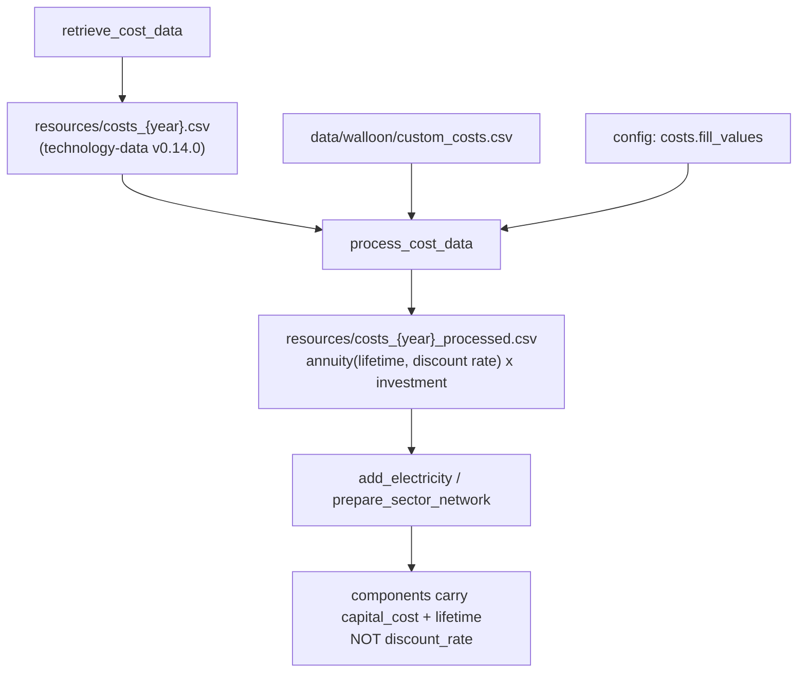
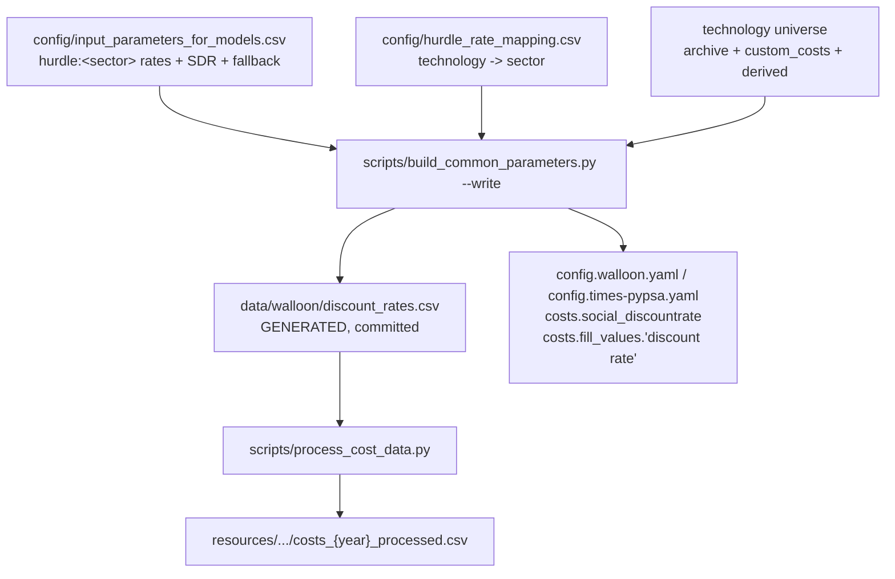

# Discount rates in PyPSA-Wal

How **financial discount rates** (WACC / hurdle rates) and the **social discount
rate** (SDR) are used in PyPSA-Wal, how they must be harmonised with **TIMES-WAL**,
and a step-by-step plan to drive both from the shared parameter table.

| | |
|---|---|
| **Part A** ([§1](#1-vocabulary)–[§5](#5-traps-where-a-per-technology-rate-is-silently-ignored)) | How the workflow behaves today |
| **Part B** ([§6](#6-the-three-concepts-across-the-two-models)–[§9](#9-decisions)) | The TIMES↔PyPSA harmonisation decision (ICEDD / Climact, July 2026) |
| **Part C** ([§10](#10-design)–[§14](#14-rollout-and-verification)) | Implementation plan + test plan |

Companion note: [`discount-rates-literature.md`](discount-rates-literature.md) reviews
what rates the literature and flagship reports actually support. It informs the *values*
in the shared CSV; it is **not** an input to the workflow described here.

Baseline for this note: `config/config.default.yaml` + `config/config.walloon.yaml`,
technology-data **v0.14.0** (the pin in `config/common_parameters_meta.yaml`, resolved
via `data/versions.csv`), `costs.year: 2050`, cost pipeline
`scripts/process_cost_data.py`.

**Status:** not yet implemented. `common_parameters.md` §3.6 defers this task, and the
three `discount_rate` rows in `config/input_parameters_for_models.csv` carry
`status=pending`. Part C is the plan that closes both.

---

# Part A — How it works today

## 1. Vocabulary

Four distinct rates live in the workflow. They must not be conflated.

| Rate | Where it is read | Default | What it does |
|---|---|---|---|
| **Financial discount rate** (WACC / hurdle rate) | `costs.fill_values."discount rate"` → the `discount rate` column of the cost table | **7%** (**4%** for 8 technologies) | Annualises overnight CAPEX into `capital_cost` (EUR/MW/a) |
| **Social discount rate** (SDR) | `costs.social_discountrate` | **2%** | Weights cost flows across investment periods — **perfect-foresight runs and post-processing only** |
| **EGS rate** | hardcoded read of `costs.fill_values."discount rate"` | 7% | Annualises enhanced-geothermal and ORC CAPEX ([§5.1](#51-enhanced-geothermal-bypasses-the-cost-table)) |
| **Retrofit interest rate** | `sector.retrofitting.interest_rate` | **4%** | Annualises building-envelope renovation cost — a **completely separate** rate that never touches the cost table ([§5.2](#52-building-retrofit-uses-its-own-rate)) |

The financial rate reflects the **cost of capital over an asset's economic lifetime**.
The **SDR** reflects *society's* time preference — how policy-makers trade well-being
today against well-being in the future — and is typically derived from the Ramsey rule
`r = ρ + μg` (see [HM Treasury Green Book](https://www.gov.uk/government/publications/the-green-book)).
Developed-country values are usually 2–7%. In PyPSA-Wal the SDR is a **single global
scalar**: it is not technology-specific and does **not** enter CAPEX annualisation.

PyPSA-Wal does **not** propagate a discount rate onto network components. The
financial rate is applied **upstream**, when the processed cost table is built;
components receive pre-annualised `capital_cost`.

## 2. The cost pipeline


```mermaid
flowchart TD
    A[retrieve_cost_data] --> B["resources/costs_{year}.csv<br/>(technology-data v0.14.0)"]
    B --> C[process_cost_data]
    D["data/walloon/custom_costs.csv"] --> C
    E["config: costs.fill_values"] --> C
    C --> F["resources/costs_{year}_processed.csv<br/>annuity(lifetime, discount rate) x investment"]
    F --> G[add_electricity / prepare_sector_network]
    G --> H["components carry capital_cost + lifetime<br/>NOT discount_rate"]
```

`rule process_cost_data` lives in `rules/build_electricity.smk:645`. Inside
`prepare_costs()` the order of operations is what matters — a rate written at the
wrong step is silently overwritten:

| # | `process_cost_data.py` | Effect on `discount rate` |
|---|---|---|
| 1 | `:147` unstack to one row per technology | 8 techs have 0.04 from technology-data, 289 are `NaN` |
| 2 | `:150` `overwrite_costs(costs, custom_raw)` | **`custom_costs.csv` rows land here** — and may *add* technologies (`:62-64`) |
| 3 | `:151` `fillna(config["fill_values"])` | every remaining `NaN` becomes **0.07** |
| 4 | `:152-160` config `overwrites` loop | **`discount rate` is NOT in the whitelist** — see [§5.4](#54-config-costs-overwrites-cannot-set-a-discount-rate) |
| 5 | `:171` `calculate_annuity(costs["lifetime"], costs["discount rate"])` | the annuity — **already vectorised over technologies** |
| 6 | `:175`–`:234` clones, renames, storage aggregates | a per-tech rate is inert for some rows — [§5.3](#53-cloned-and-derived-rows-ignore-their-own-rate) |

`calculate_annuity()` (`scripts/add_electricity.py:152`) accepts a **pandas Series** of
rates, so per-technology annualisation needs no code change to work mechanically.

## 3. Current numbers

Cost tables actually produced by the workflow
(`resources/walloon-model/costs_2050_processed.csv`) contain **307** technologies —
297 from the technology-data archive, plus `nuclear retrofit` (added by
`custom_costs.csv`), `solar-hsat` (rename of `solar-utility single-axis tracking`),
`waste` (clone of `waste CHP`), and 8 storage aggregates.

| `discount rate` | count | source |
|---|---|---|
| **0.07** | 291 | `costs.fill_values."discount rate"` |
| **0.04** | 8 | explicit technology-data rows |
| **NaN** | 8 | storage aggregates, created *after* the fill ([§5.3](#53-cloned-and-derived-rows-ignore-their-own-rate)) |

The eight technology-data 0.04 rows (identical in `costs_2025/2030/2040/2050.csv`,
source "Palzer thesis"): `decentral CHP`, `decentral air-sourced heat pump`,
`decentral gas boiler`, `decentral ground-sourced heat pump`,
`decentral resistive heater`, `decentral solar thermal`,
`decentral water tank storage`, `solar-rooftop`.

Note what that set *excludes* while being nominally "decentral":
`solar-rooftop commercial`, `solar-rooftop residential`, `decentral oil boiler`,
`decentral gas boiler connection`, `decentral water tank charger`/`discharger`,
`micro CHP`, `home battery storage`, `home battery inverter` — all at 7%.

## 4. What is and is not supported

| Question | Answer |
|---|---|
| Can technologies have different **financial** rates? | **Yes.** `prepare_costs()` annualises per technology; `calculate_annuity()` is vectorised. |
| Are different rates used today? | **Barely** — 291 of 307 at 7%, 8 at 4%. |
| Which levers set a per-technology rate? | Only two: a technology-data `discount rate` row, or a `discount rate` row in `custom_costs.csv`. |
| Does `config: costs: overwrites:` work for it? | **No** — silently ignored ([§5.4](#54-config-costs-overwrites-cannot-set-a-discount-rate)). |
| Does PyPSA store per-component `discount_rate` here? | **No** — only `capital_cost` and `lifetime` are assigned. |
| Per-technology **social** discount rates? | **No** — single global scalar; not supported by PyPSA. |

PyPSA ≥ 1.1 also supports an `overnight_cost` + `discount_rate` + `lifetime`
(+ `fom_cost`) API, where PyPSA itself annualises via `pypsa.costs.periodized_cost()`
and each component row carries its own rate. **PyPSA-Wal does not use that path**
(and `envs/environment.yaml` only floors `pypsa >=0.35.2`, which predates it). Switching
is a broader refactor — see [§9](#9-decisions).

### Setting a per-technology rate today (no code changes)

Add rows to the file named by `costs.custom_cost_fn` — for the Walloon study
`data/walloon/custom_costs.csv`:

```csv
planning_horizon,technology,parameter,value,unit,source,further_description
all,onwind,discount rate,0.075,per unit,TIMES hurdle — production,
all,nuclear,discount rate,0.075,per unit,TIMES hurdle — production,
```

- `planning_horizon: all` applies to every horizon; a specific year overrides only
  that year.
- `technology: all` **blanket-overwrites every technology** (`process_cost_data.py:72-74`)
  — it would flatten the eight 0.04 rows. Use with care.
- Do not also override `capital_cost` for the same technology: a direct
  `capital_cost` row bypasses the annuity, making the rate irrelevant.

Then re-run the cost and network rules.

## 5. Traps: where a per-technology rate is silently ignored

### 5.1 Enhanced geothermal bypasses the cost table

`scripts/prepare_sector_network.py:6359` (`add_enhanced_geothermal()`) reads the
**global fill value**, not the `geothermal` row:

```python
dr = costs_config["fill_values"]["discount rate"]
egs_annuity = calculate_annuity(lt, dr)
orc_annuity = calculate_annuity(costs.at["organic rankine cycle", "lifetime"], dr)
```

It also uses a **different FOM convention** — `FOM / (1.0 + FOM)` at `:6374`/`:6384`
versus `FOM / 100.0` in `process_cost_data.py:172`. Both are worth fixing together;
the rate fix is ~2 lines.

### 5.2 Building retrofit uses its own rate

`scripts/build_retro_cost.py:1066` reads `sector.retrofitting.interest_rate`
(`config/config.default.yaml:834`, **0.04**) and applies its own annuity at `:500-501`
and `:604-605`. This never touches the cost table, so **no `custom_costs.csv` row can
reach it**. It matters for harmonisation: renovation is TIMES's headline demand-side
lever, priced there at 11–12%, and 4% here is the same inversion described in
[§8](#8-current-misalignment) — but for the one decision TIMES cares most about.

### 5.3 Cloned and derived rows ignore their own rate

| Row | `process_cost_data.py` | Consequence |
|---|---|---|
| `solar` | `:186` `capital_cost` copied from `solar-utility` | giving `solar` a rate has **no effect** |
| `waste` | `:175` whole row cloned from `waste CHP`, *after* the annuity | inherits `waste CHP`'s rate **and** its `capital_cost` |
| `battery`, `li-ion`, `lfp`, `vanadium`, `lair`, `pair`, `iron-air`, `H2` | `:212-234`, *after* the fill | `discount rate` stays **NaN**; `capital_cost` is summed from the component rows, which carry their own rates |

The eight storage aggregates are harmless today, but they mean a naive
"every row must have an explicit rate" invariant **will fail** unless they are
excluded deliberately.

### 5.4 `config: costs: overwrites:` cannot set a discount rate

The loop at `process_cost_data.py:152-160` whitelists only `investment`, `lifetime`,
`FOM`, `VOM`, `efficiency`, `fuel`, `standing losses`. A
`costs: overwrites: {"discount rate": {...}}` block — including from
`config/scenarios.walloon.yaml` — is **silently discarded**, with no warning.
(Earlier revisions of this note claimed otherwise.)

### 5.5 `prepare_costs()` is not callable outside Snakemake

Two defects to be aware of before writing tests:

- `:121` binds `custom_raw`/`custom_prepared` only `if custom_costs_fn is not None`,
  but `:150` and `:237` use them unconditionally → `NameError` when
  `costs.custom_cost_fn: null`.
- `:123` and `:126` read the **globals** `snakemake.input.custom_costs` and
  `planning_horizon` instead of the function's own `custom_costs_fn` parameter.

Both must be fixed for [§13](#13-tests-to-add) test T11 to be writable.

---

# Part B — TIMES↔PyPSA harmonisation

Source: email exchanges with Julien Simon (ICEDD) and Dimitri Krings (Climact),
July 2026. Goal: consistent inputs and comparable results across the coupled workflow.

## 6. The three concepts across the two models

| Concept | TIMES | PyPSA-Wal |
|---|---|---|
| **SDR** — weights all cost flows between periods | **3.5%**, aligned with the Belgian OLO rate, defended at project start | `costs.social_discountrate` = **2%**; active only in perfect-foresight runs and present-value post-processing |
| **Hurdle rate** — annualises overnight CAPEX; financing cost **plus** decision/behavioural barriers from perceived risk | sector-specific **7.5–12%** ([§7](#7-agreed-rates)) | per-technology `discount rate` → `capital_cost`; **7%**, 4% for eight technologies |
| **Administrative barriers** — permits, renovation pace, works disruption | **not** in hurdle rates — modelled as rate constraints | same principle: use constraints or exogenous capacity paths, never the rate |

PyPSA-Wal runs **myopic** foresight (`config/config.walloon.yaml`), so the optimiser
does **not** discount between planning horizons — each step optimises within one
period. Julien's initial reading that TIMES's 3.5% "has no direct equivalent" is
therefore correct **for the operational solve**. Harmonising the SDR still matters for
perfect-foresight experiments and for `make_cumulative_costs.py` /
`make_summary_perfect.py`, which express future-period costs in present value: comparing
cumulative costs against TIMES at 2% versus 3.5% is not comparing like with like.

## 7. Agreed rates

TIMES hurdle rates by investor sector (Julien, July 2026), with the short token used
throughout Part C:

| Token | Rate | TIMES sector | Representative technologies |
|---|---|---|---|
| `production` | **7.5%** | Electricity production, cogen, PV, upstream energy, **all transport** | on/offshore wind, hydro, nuclear, gas plants, PV, cogen, electricity storage, grids, district heating, DAC, EV charging and vehicles |
| `industry` | **10%** | Industry | industrial heat pumps, electric/gas/biomass boilers, process CO₂ capture, feedstock |
| `tertiary` | **11%** | Tertiary and agriculture | tertiary heat pumps, gas boilers, solar thermal, tertiary retrofit |
| `residential` | **12%** | Residential | residential heat pumps (air/geothermal), gas boilers, decentral thermal storage, residential retrofit |

Plus **SDR = 3.5%**.

**Assignment rule:** give each PyPSA technology the hurdle rate of the **sector that
owns the investment decision** — not the sector it serves. Technologies TIMES treats
as supply/production — **utility PV, rooftop PV, domestic batteries, district heating
networks** — take **7.5%** even when they serve households.

## 8. Current misalignment

| | TIMES logic | PyPSA-Wal today |
|---|---|---|
| Residential / decentral heat | **12%** — high hurdle, favours OPEX over CAPEX | **4%** for eight decentral technologies — *inverted* |
| Building retrofit | **11–12%** | **4%** (`sector.retrofitting.interest_rate`, [§5.2](#52-building-retrofit-uses-its-own-rate)) — *inverted* |
| Utility-scale generation | **7.5%** | 7% — close, not identical |
| Everything else | sector-specific | 7% flat |

The master CSV adds a third position: the three `discount_rate` rows in
`config/input_parameters_for_models.csv` record an *agreed* value of **4%** flat
(`status=pending`, note written by `scripts/apply_common_parameters_decisions.py:59`).
That predates the sectoral hurdles and is superseded by [§7](#7-agreed-rates) — it must
be explicitly renegotiated, not quietly left in place.

Dimitri noted that a December test with higher uniform rates had a **strong impact**
(sharp drop in renewables). Expect the re-alignment to move results materially;
re-evaluate once inputs are harmonised.

### Optimisation scope — who invests in what

| Model | Scope | Foresight |
|---|---|---|
| **TIMES** | **Demand** — vector choice, consumption technologies (heat pumps, boilers, EVs, district heating), renovation | perfect foresight on vector arbitrage |
| **PyPSA** | **Electricity supply** — utility and rooftop PV, wind, batteries, nuclear, grids | myopic within the electricity vector; dispatch, interconnectors |

**Agreed division:** TIMES optimises demand-side investment and fuel/vector switching;
decentral heating capacities and electrification levels are **imposed on PyPSA** from
TIMES outputs. PyPSA keeps operational flexibility but must **not** re-optimise the
same build-out — otherwise the two models reconstruct different fleets.

PyPSA-Wal **can** currently still invest in decentral heat pumps, boilers, and solar
thermal. Verify and, if needed, wire constraints or exogenous capacities from TIMES.
Note the interaction with hurdle rates: if a technology's capacity is imposed
exogenously, its hurdle rate no longer changes the build decision — only the reported
cost.

### Scenario design — when hurdle rates apply

Two scenarios define a **technology range** for network operators, not a point estimate:

| Scenario | Demand | Hurdle rates |
|---|---|---|
| **Demande maîtrisée / transition PACE** | full implementation of demand-side policies | **none** in either model — barriers assumed removed by policy |
| **Trajectoire réaliste** | high demand | **applied** in both models |

The gap gives (1) a min–max range per technology for grid planners and (2) a
quantification of upside from de-risking mechanisms (e.g. CfDs from work package 2).
Administrative pace limits stay in constraints, never in the rate.

Both scenarios must be runnable **side by side** — the gap is the deliverable — so
neither can be expressed by editing the base rates in the shared table. Whatever rates a
scenario needs, define them as a **named variant**:
[§10.5](#105-scenario-variants--alternative-hurdle-rates-from-the-csv).

## 9. Decisions

All **decided** — Part C implements the "action" column as written. The rate *values*
themselves are a separate modelling question; the evidence base for choosing them is
reviewed in [`discount-rates-literature.md`](discount-rates-literature.md), which is
**not** an input to the implementation.

| # | Question | Decision |
|---|---|---|
| D1 | The master CSV's flat 4% vs the sectoral 7.5–12% | **Retire the flat 4%.** Repurpose those three rows as the **fallback** rate at **0.075** ([S1](#s1--add-the-rates-to-the-master-csv)). Confirm the number with ICEDD, but the *mechanism* does not wait on it — the fallback only reaches unmapped technologies. |
| D2 | **No tertiary/residential split** in the cost table — one `decentral *` family serves both | **Map all `decentral *` to `residential` (12%).** No demand-weighted blend: a blend is unauditable and cannot be reproduced from the CSV. `tertiary` stays defined in the shared table so it remains faithful to TIMES and a future split can use it. |
| D3 | SDR 3.5% in myopic runs | **Set `costs.social_discountrate: 0.035`.** Inert in the myopic solve, and it makes cumulative-cost reporting comparable with TIMES ([S6](#s6--patch-the-sdr-and-the-fallback-into-the-configs)). |
| D4 | `sector.retrofitting.interest_rate` (4%) | **Out of scope for this plan; tracked separately.** It is not part of the cost table, so no `custom_costs.csv` or hurdle-file row can reach it ([§5.2](#52-building-retrofit-uses-its-own-rate)). Raising it to the `residential` rate needs its own change and its own impact check. |
| D5 | Reverting the eight technology-data 0.04 rates | **Yes** — the generated file is applied after the fill and overrides them ([S8](#s8--read-the-file-in-process_cost_datapy)). Expect a visible result shift ([§8](#8-current-misalignment)); quantify it in [§14](#14-rollout-and-verification) before publishing. |
| D6 | The rates each scenario uses | **Per-scenario CSV variants** ([§10.5](#105-scenario-variants--alternative-hurdle-rates-from-the-csv)) — no code change to add one. A rate of **0** is never used: the annuity collapses to `1/lifetime`, i.e. free capital. |
| D7 | Per-component PyPSA-native `discount_rate` API | **Not now.** Medium–high effort; `envs/environment.yaml` floors `pypsa >=0.35.2`, which predates it. Revisit only if an audit trail on the network object is required. |

---

# Part C — Implementation plan

Goal: **every** technology in the cost table gets an explicit, auditable hurdle rate
derived from `config/input_parameters_for_models.csv`; the SDR is harmonised from the
same file; a missing rate produces a loud error **and** a safe fallback.

## 10. Design

### 10.1 Data flow


```mermaid
flowchart TD
    M["config/input_parameters_for_models.csv<br/>hurdle:&lt;sector&gt; rates + SDR + fallback"] --> S[scripts/build_common_parameters.py --write]
    P["config/hurdle_rate_mapping.csv<br/>technology -> sector"] --> S
    U["technology universe<br/>archive + custom_costs + derived"] --> S
    S --> G["data/walloon/discount_rates.csv<br/>GENERATED, committed"]
    S --> Y["config.walloon.yaml / config.times-pypsa.yaml<br/>costs.social_discountrate<br/>costs.fill_values.'discount rate'"]
    G --> PC[scripts/process_cost_data.py]
    PC --> R["resources/.../costs_{year}_processed.csv"]
```

### 10.2 Why two files, not one

| File | Owner | Holds |
|---|---|---|
| `config/input_parameters_for_models.csv` | **shared** with TIMES/ICEDD | the **rates** — 4 sector hurdles, the SDR, the fallback |
| `config/hurdle_rate_mapping.csv` | **pypsa-wal** | the **assignment** — one row per technology → sector |

The mapping needs ~307 rows, most for technologies TIMES never models
(`Container feeder, methanol`, `Zn-Br-Nonflow-store`, …). Putting them in the shared
negotiation table would bury the four numbers that actually get negotiated. Rates
change with ICEDD; the assignment is a stable modelling decision.

The mapping is keyed on **real cost-table technology names**. Do **not** join on the
master CSV's `technology_name_pypsa` column — it is a human label, not a key
(`solar rooftop` vs `solar-rooftop`, `Eletricity distribution grid` [sic],
`Nuclear (SMR)`, `Battery storage (utility)`). The reliable key in the master CSV is
`pypsa_wal_target`.

### 10.3 Precedence and fallback

Highest wins:

1. **Per-technology override** — an active `cost:<tech>:discount rate` target in the
   master CSV. Escape hatch for a single technology that deviates from its sector.
2. **Sector rate** — `hurdle:<variant>:<sector>` when generating a named variant,
   otherwise `hurdle:<sector>`, for the technology's sector in the mapping
   ([§10.5](#105-scenario-variants--alternative-hurdle-rates-from-the-csv)).
3. **Fallback** — `config:costs.fill_values.discount rate` (D1: 0.075). Applies only to
   a technology absent from the mapping; it is a safety net, **not** a scenario lever.

`hurdle_sector: none` in the mapping means *deliberately excluded* — no row is written,
and `process_cost_data.py`'s own `fillna` handles it. Reserved for the eight storage
aggregates and the `solar`/`waste` clones of [§5.3](#53-cloned-and-derived-rows-ignore-their-own-rate),
where a rate is provably inert. `none` must be **explicit**, so silence is never
mistaken for a decision.

### 10.4 Single authority

`data/walloon/discount_rates.csv` becomes the **only** source of a per-technology
`discount rate` for the Walloon runs. Consequences to enforce:

- `--check` **fails** if `custom_costs.csv` contains any `discount rate` row (two
  sources of truth would silently fight, since the generated file is applied later).
- The generated file already resolves the precedence in [§10.3](#103-precedence-and-fallback),
  so `process_cost_data.py` has exactly one authority to read.
- Unlike the four existing destinations, this file is **generated wholesale**, not
  patched in place — so `common_parameters.md` §5.1's "never generate" principle gains
  a documented exception. It is still committed, so `git diff` shows what changed and
  a run works without the script.

### 10.5 Scenario variants — alternative hurdle rates from the CSV

A scenario that needs different hurdle rates does **not** get them by editing the base
rates: that would change every run. Instead the master CSV can hold any number of
**named variants**, `--write` generates one file per variant, and a scenario selects one
through `costs.hurdle_rate_fn`.

**1. Add variant rows to `config/input_parameters_for_models.csv.`** The target gains a
variant segment:

| Target | Meaning |
|---|---|
| `hurdle:<sector>` | base rate — used by `data/walloon/discount_rates.csv` |
| `hurdle:<variant>:<sector>` | rate for named variant `<variant>` |

A variant **inherits every sector it does not override**, matching the convention
already stated at the top of `config/scenarios.walloon.yaml` ("a scenario only lists
what it *changes*"). So a variant that puts all four sectors at 3.5% is four rows, and
one that only re-prices residential is one row:

| `parameter` | `value` | `pypsa_wal_target` | `status` |
|---|---|---|---|
| `discount_rate` | `0.035` | `hurdle:lowrate:production` | `active` |
| `discount_rate` | `0.035` | `hurdle:lowrate:industry` | `active` |
| `discount_rate` | `0.035` | `hurdle:lowrate:tertiary` | `active` |
| `discount_rate` | `0.035` | `hurdle:lowrate:residential` | `active` |
| `discount_rate` | `0.09` | `hurdle:resid09:residential` | `active` |

Same column conventions as [S1](#s1--add-the-rates-to-the-master-csv): yearless row,
`units=per unit`, `year_rule=hold`. Variant names must match `[a-z0-9_]+` so they are
safe in a filename.

**2. `--write` generates one file per variant**, discovered from the CSV — no code
change is needed to add one:

| Variant in CSV | Generated file |
|---|---|
| *(none — base)* | `data/walloon/discount_rates.csv` |
| `lowrate` | `data/walloon/discount_rates_lowrate.csv` |
| `resid09` | `data/walloon/discount_rates_resid09.csv` |

Every variant file covers the **same technology list** as the base file, so a technology
can never be priced in one variant and forgotten in another. Validation
([S5](#s5--wire-validation-into-the-existing-modes)) and the fallback of
[§10.3](#103-precedence-and-fallback) apply to each variant independently.

**3. Point a scenario at the file** in `config/scenarios.walloon.yaml`:

```yaml
scen_lowrate:
  sector:
    times_file: data/walloon/scen_corrige_251129_0112.vd
  costs:
    hurdle_rate_fn: data/walloon/discount_rates_lowrate.csv
  solving:
    agg_p_nom_limits:
      file: data/walloon/agg_p_nom_minmax_corrige.csv
```

Add the scenario name to `run.name` in `config/config.times-pypsa.yaml` and run as
usual; results land in `results/times-pypsa/scen_lowrate/`.

No new machinery is involved: `config_provider` resolves the key per-`{run}` via
`dynamic_getter` → `scenario_config` → `merge_configs` (`rules/common.smk:43,56,72`),
and `scen_imppel` already overrides a **file path** per scenario
(`electricity.walloon_potentials`).

> **Two levers that look equivalent but do nothing.** Overriding
> `costs.fill_values."discount rate"` in a scenario has no effect on any mapped
> technology — the hurdle file is applied *after* the fill and shadows it
> ([§10.4](#104-single-authority)). And setting `hurdle_rate_fn: null` does not give a
> uniform rate: the eight technology-data rows of [§3](#3-current-numbers) stop being
> overridden and revert to 0.04. **A variant file is the only working lever.**

### S1 — Add the rates to the master CSV

`config/input_parameters_for_models.csv`. One **yearless** row per sector
(`collect_targets()` expands a yearless row onto every horizon, so all four are
covered). Fill every column the existing rows use; `status=active`, `year_rule=hold`,
`units=per unit`, `data_origin_choice=TIMES`.

| `technology_name_fr` | `parameter` | `value` | `pypsa_wal_target` |
|---|---|---|---|
| Taux d'actualisation — production | `discount_rate` | `0.075` | `hurdle:production` |
| Taux d'actualisation — industrie | `discount_rate` | `0.10` | `hurdle:industry` |
| Taux d'actualisation — tertiaire | `discount_rate` | `0.11` | `hurdle:tertiary` |
| Taux d'actualisation — résidentiel | `discount_rate` | `0.12` | `hurdle:residential` |
| Taux d'actualisation social | `discount_rate` | `0.035` | `config:costs.social_discountrate` |

Use `type=discount_rate` for these rows (nothing validates `type`).

To make a hurdle time-varying later, replace the yearless row with one row per horizon
and keep `year_rule=hold`. To give a scenario its own rates, add
`hurdle:<variant>:<sector>` rows instead of editing these
([§10.5](#105-scenario-variants--alternative-hurdle-rates-from-the-csv)).

Then **edit the three existing rows** (currently `energy_price` /
`technology_name_pypsa = "Discount rate"` / `config:costs.fill_values.discount rate`):
`status: pending → active`, `value: 0.04 → 0.075` (D1), and rewrite
`note_complementaire` to say it is now the fallback.

> **Also update `scripts/apply_common_parameters_decisions.py`** — `NOTE_DISCOUNT`
> (`:59-64`) and the `--- 4. Discount rate ---` block (`:219-225`) force those rows
> back to `status=pending`. Re-running it would undo S1. Change the block to set
> `status=active` and rewrite the note.

**Verify:** `python scripts/build_common_parameters.py --report` — the new
`hurdle` family appears under "active target families", and `--check` no longer
reports the rows as pending.

### S2 — Create the mapping file

`config/hurdle_rate_mapping.csv`:

```csv
technology,hurdle_sector,note
onwind,production,TIMES: electricity production
solar,none,"capital_cost cloned from solar-utility (process_cost_data.py:186)"
decentral air-sourced heat pump,residential,"D2: no tertiary split in the cost table"
industrial heat pump high temperature,industry,TIMES: industry
battery,none,"storage aggregate; capital_cost summed from components"
```

- `hurdle_sector` ∈ `production` | `industry` | `tertiary` | `residential` | `none`.
- **One row per technology in the universe** ([S3](#s3--enumerate-the-technology-universe)) — all ~307.
- `note` is mandatory for `none` and for any non-obvious assignment.

Seed it mechanically, then review by hand:

| Pattern | Sector |
|---|---|
| `decentral *`, `micro CHP` | `residential` (D2) |
| `industrial heat pump *`, `* steam`, `electric arc furnace*`, `cement *`, `blast furnace*`, `* direct iron reduction furnace`, `iron ore *`, `* carbon capture retrofit`, `electric steam cracker` | `industry` |
| `central *` (district heating), `solar-rooftop*`, `home battery *`, all generation, storage, grid, H2, CO₂, synfuel, shipping, transport/vehicle/charging rows | `production` |
| `solar`, `waste`, the 8 storage aggregates | `none` |

There is **no `tertiary` carrier** in the cost table (D2) — expect zero `tertiary` rows
and keep the sector defined anyway, so the shared CSV stays faithful to TIMES and a
future split can use it.

### S3 — Enumerate the technology universe

In `scripts/build_common_parameters.py`, add:

```python
COST_ARCHIVE_GLOB = "costs_*.csv"
COST_TABLE_RENAMES = {"solar-utility single-axis tracking": "solar-hsat"}
COST_TABLE_CLONES = {"waste": "waste CHP"}
HURDLE_MAPPING_FILE = ROOT / "config" / "hurdle_rate_mapping.csv"
DISCOUNT_RATES_FILE = ROOT / "data" / "walloon" / "discount_rates.csv"
HURDLE_SECTORS = ("production", "industry", "tertiary", "residential")


def cost_table_technologies(meta: dict) -> set[str]:
    """Every technology key the processed cost table will contain.

    Mirrors the transformations in process_cost_data.py — keep in sync; test T1
    cross-checks against a real processed CSV when one exists.
    """
    archive = ROOT / meta["technology_data"]["archive_dir"]
    techs: set[str] = set()
    for path in sorted(archive.glob(COST_ARCHIVE_GLOB)):
        techs |= set(pd.read_csv(path)["technology"].dropna().unique())

    # custom_costs.csv may add technologies (process_cost_data.py:62-64)
    techs |= set(_read_str(COSTS_FILE)["technology"]) - {"all"}

    for old, new in COST_TABLE_RENAMES.items():   # :187
        techs.discard(old)
        techs.add(new)
    techs |= set(COST_TABLE_CLONES)               # :175

    # storage aggregates (:212-234): STORE_LOOKUP keys present in max_hours
    from scripts.add_electricity import STORE_LOOKUP

    cfg = yaml.safe_load(WALLOON_CONFIG.read_text())
    max_hours = cfg.get("electricity", {}).get("max_hours") or _default_max_hours()
    techs |= {k for k in max_hours if k in STORE_LOOKUP}
    return techs
```

`_default_max_hours()` must read `config/config.default.yaml` (`electricity.max_hours`,
`:126`), because `config.walloon.yaml` does not set it.

Parse the archive CSVs with a **real CSV reader** — they contain quoted fields with
embedded commas and newlines (`Container, ammonia`, `Tank&bulk, diesel`), so
`cut -d,` yields 295 junk keys instead of 297.

### S4 — Resolve rates and generate the file

```python
@dataclass
class HurdleResolution:
    rates: dict[str, dict[int, float]]   # technology -> {horizon: rate}
    sectors: dict[str, str]              # technology -> sector (or "none")
    unmapped: list[str]                  # in universe, absent from mapping
    unknown_sector: list[str]            # mapping names a sector with no rate
    fallback: dict[int, float]


def resolve_hurdle_rates(df, meta, horizons) -> HurdleResolution:
    sector_rates = collect_targets(df, "hurdle", horizons, nparts=1)   # §10.3 rule 2
    per_tech = {
        k[0]: t for k, t in collect_targets(df, "cost", horizons, nparts=2).items()
        if k[1] == "discount rate"                                     # rule 1
    }
    fallback_tgt = collect_targets(df, "config", horizons, nparts=1).get(
        ("costs.fill_values.discount rate",)
    )
    ...
```

Then write `data/walloon/discount_rates.csv` — **same schema as
`custom_costs.csv`**, so `process_cost_data.py` can reuse the identical parsing:

```csv
planning_horizon,technology,parameter,value,unit,source,further_description
all,onwind,discount rate,0.075,per unit,input_parameters_for_models.csv,TIMES hurdle: production
all,decentral air-sourced heat pump,discount rate,0.12,per unit,input_parameters_for_models.csv,TIMES hurdle: residential
2030,electrolysis,discount rate,0.075,per unit,input_parameters_for_models.csv,TIMES hurdle: production
```

Rules:

- `parameter` is always the literal **`discount rate`** (with a space) — that is the
  cost-table column name (`process_cost_data.py:171`).
- Emit `planning_horizon: all` when the rate is constant across horizons (it is,
  today); otherwise one row per horizon. Reuse `Target.constant`.
- Sort by `technology` so the diff is stable.
- Skip `hurdle_sector: none` technologies entirely.
- Write a generated-file banner in `further_description` of every row, since CSV has no
  comment convention here.

Emit **one file per variant** ([§10.5](#105-scenario-variants--alternative-hurdle-rates-from-the-csv)).
Variants are discovered from the CSV, so adding one needs no code change:

```python
def hurdle_variants(df, horizons) -> dict[str | None, dict[str, Target]]:
    """Sector rates per variant. Key None is the base; a variant inherits any
    sector it does not override."""
    base = collect_targets(df, "hurdle", horizons, nparts=1)       # hurdle:<sector>
    out: dict[str | None, dict[str, Target]] = {None: {k[0]: v for k, v in base.items()}}
    for (variant, sector), tgt in collect_targets(
        df, "hurdle", horizons, nparts=2                           # hurdle:<var>:<sector>
    ).items():
        out.setdefault(variant, dict(out[None]))[sector] = tgt
    return out


def variant_path(variant: str | None) -> Path:
    return (
        DISCOUNT_RATES_FILE
        if variant is None
        else DISCOUNT_RATES_FILE.with_name(f"discount_rates_{variant}.csv")
    )
```

Every variant file lists the **same technologies** as the base, so a technology can
never be priced in one variant and forgotten in another. All files are committed; never
hand-edit one — [S5](#s5--wire-validation-into-the-existing-modes) validates each
variant independently and test T10 fails on drift.

### S5 — Wire validation into the existing modes

Add to `cmd_check` / `cmd_write` / `cmd_report`:

| Condition | Severity | Behaviour |
|---|---|---|
| Mapping names a sector with no active `hurdle:<sector>` row | **hard error** | nothing written — a typo must never fall back silently |
| Two mapping rows for the same technology | **hard error** | nothing written |
| `hurdle_sector` not in `HURDLE_SECTORS ∪ {none}` | **hard error** | nothing written |
| Mapping row for a technology **not** in the universe | **error** | file still written (a stale row is harmless but must be visible) |
| Technology in universe, **absent** from mapping | **error, fallback applied** | file written with the fallback rate; **exit 1** |
| No active `config:costs.fill_values.discount rate` row | **hard error** | there would be no fallback to apply |
| `custom_costs.csv` contains a `discount rate` row | **hard error** | [§10.4](#104-single-authority) |
| Sector rate outside `0 ≤ r < 0.30` | **hard error** | catches `7.5` written for `0.075` |
| Variant name not matching `[a-z0-9_]+` | **hard error** | it becomes part of a filename |
| `hurdle:<variant>:<sector>` naming a sector outside `HURDLE_SECTORS` | **hard error** | a typo'd variant sector would silently inherit the base rate |

Run every check **per variant** ([§10.5](#105-scenario-variants--alternative-hurdle-rates-from-the-csv)):
a variant is not a special case, just another output file.

The asymmetry is deliberate: an unmapped technology must never **block a run** (a
technology-data bump would brick the workflow), but must never **pass CI** either.
Message format:

```
data/walloon/discount_rates.csv: 3 technology(ies) have no row in
config/hurdle_rate_mapping.csv — the fallback rate 0.075 was written for them:
  - biochar pyrolysis
  - seawater RO desalination
  - Zn-Air-store
Add each to config/hurdle_rate_mapping.csv with one of
production|industry|tertiary|residential, or hurdle_sector=none if a rate is inert.
```

Also extend `report_patch()`/`cmd_report` to print the per-sector technology counts, so
a bad bulk assignment is obvious at a glance.

### S6 — Patch the SDR and the fallback into the configs

Add `patch_costs_scalars()` patching **both** `config/config.walloon.yaml` and
`config/config.times-pypsa.yaml`:

- `costs.social_discountrate` ← `config:costs.social_discountrate` (0.035)
- `costs.fill_values."discount rate"` ← the fallback (0.075)

Follow the existing in-place philosophy: find the key with an anchored regex inside
the `costs:` block and rewrite only the scalar. If the key is **absent**, emit an error
telling the user the exact line to add — do not synthesise YAML structure. Both files
currently have a two-line `costs:` block, so the keys must be added by hand once:

```yaml
costs:
  custom_cost_fn: data/walloon/custom_costs.csv
  hurdle_rate_fn: data/walloon/discount_rates.csv
  social_discountrate: 0.035
  fill_values:
    "discount rate": 0.075
```

Do **not** edit `config/config.default.yaml` — it is generated from the pydantic model
by `pixi run generate-config`.

> **Verify the merge semantics.** A partial `fill_values` override must deep-merge with
> the default (which supplies `FOM`, `VOM`, `lifetime`, …), not replace it. Snakemake's
> `configfile:` directive uses a recursive update, so it should — but confirm it before
> relying on it. Test T8 pins this.

### S7 — Add the config key and regenerate the schema

`scripts/lib/validation/config/costs.py` — next to `custom_cost_fn` (`:76-79`):

```python
hurdle_rate_fn: str | None = Field(
    default=None,
    description="CSV of per-technology financial discount (hurdle) rates, "
    "generated by scripts/build_common_parameters.py --write.",
)
```

Then regenerate the derived artefacts, or `test_config_schema.py` fails:

```bash
pixi run generate-config
```

This rewrites `config/config.default.yaml` and `config/schema.json`. Commit them.

### S8 — Read the file in `process_cost_data.py`

Apply the rates **after** `fillna` and **before** the annuity, so they override both
the 0.07 fill and the eight technology-data 0.04 rows (D5). Insert between `:151` and
`:171`:

```python
    # Per-technology hurdle rates (config/input_parameters_for_models.csv via
    # build_common_parameters.py). Authoritative: applied after the fill_values
    # fallback and before the annuity, so it wins over technology-data too.
    if hurdle_rate_fn is not None:
        hurdle = pd.read_csv(
            hurdle_rate_fn, dtype={"planning_horizon": "str"}
        ).query("planning_horizon in [@planning_horizon, 'all']")
        rates = hurdle.set_index("technology")["value"]
        unknown = rates.index.difference(costs.index)
        if len(unknown):
            logger.warning(
                "%s lists %d technology(ies) absent from the cost table, ignored: %s",
                hurdle_rate_fn, len(unknown), sorted(unknown),
            )
        known = rates.index.intersection(costs.index)
        costs.loc[known, "discount rate"] = rates.loc[known].astype(float)
        missing = costs.index.difference(rates.index)
        if len(missing):
            logger.warning(
                "%d technology(ies) have no hurdle rate and keep the "
                "costs.fill_values fallback %.4g: %s",
                len(missing), config["fill_values"]["discount rate"], sorted(missing),
            )

    assert costs["discount rate"].notna().all(), (
        "NaN discount rate would silently produce NaN capital_cost for: "
        f"{sorted(costs.index[costs['discount rate'].isna()])}"
    )
```

Note `rates.index` may contain duplicates if S4 emitted per-horizon rows — the `.query`
already narrows to one horizon, so it will not; assert it if you prefer.

While in this file, fix the two defects in [§5.5](#55-prepare_costs-is-not-callable-outside-snakemake)
— use the `custom_costs_fn` parameter instead of the `snakemake` global, and initialise
`custom_raw`/`custom_prepared` to empty frames when it is `None`. T11 depends on it.

### S9 — Wire the Snakemake input

`rules/build_electricity.smk:645` (`rule process_cost_data`):

```python
    input:
        network=resources("networks/base_s.nc"),
        costs=rules.retrieve_cost_data.output["costs"],
        custom_costs=config_provider("costs", "custom_cost_fn"),
        hurdle_rates=config_provider("costs", "hurdle_rate_fn"),
```

and in the script body, `hurdle_rate_fn = snakemake.input.get("hurdle_rates")`.

> A `config_provider` input that resolves to `None` must not become a required input.
> Mirror exactly how `custom_costs` handles `custom_cost_fn: null` today — check that
> before assuming, and keep `hurdle_rate_fn: null` working for a plain pypsa-eur run.

### S10 — Fix the EGS rate

`scripts/prepare_sector_network.py:6359`:

```python
    dr = costs.at["geothermal", "discount rate"]
    ...
    orc_annuity = calculate_annuity(
        costs.at["organic rankine cycle", "lifetime"],
        costs.at["organic rankine cycle", "discount rate"],
    )
```

Consider aligning the FOM convention with `process_cost_data.py:172` at the same time
([§5.1](#51-enhanced-geothermal-bypasses-the-cost-table)) — but that changes results
independently of the discount rate, so do it as a **separate commit**.

### S11 — Document

- `common_parameters.md`: close §3.6, add the generated-file exception to §5.1, add the
  two new destinations to the §2 table and the new failsafes to §5.2, tick migration
  item 8, drop the "Discount-rate harmonisation remains a later task" bullet.
- `instructions.md`: add `discount_rates.csv` and the two new config keys to the
  "Shared TIMES/PyPSA parameters" family table.

## 12. Error handling and fallback — summary

| Failure | Detected by | Result |
|---|---|---|
| Technology missing from the mapping | `--check` / `--write` ([S5](#s5--wire-validation-into-the-existing-modes)) | named in the error, **fallback written**, exit 1 |
| Mapping sector has no rate | `--check` / `--write` | hard error, **nothing written** |
| Rate out of range (`7.5` for `0.075`) | `--check` / `--write` | hard error |
| Two sources of truth (`custom_costs.csv` DR row) | `--check` / `--write` | hard error |
| Generated file absent at run time | `process_cost_data.py` ([S8](#s8--read-the-file-in-process_cost_datapy)) | `hurdle_rate_fn: null` → 0.07 fill, workflow still runs |
| Technology in the file but not the cost table | `process_cost_data.py` | logged warning, ignored |
| Technology in the cost table but not the file | `process_cost_data.py` | logged warning, `fill_values` fallback |
| `NaN` rate reaching the annuity | `process_cost_data.py` assert | run **aborts** — a `NaN` rate yields `NaN` `capital_cost` |
| Universe drifts from `process_cost_data.py` | test T1 | CI failure |

## 13. Tests to add

New file `test/test_discount_rates.py`. Conventions to match (from
`test/test_config_schema.py` and `test/test_data_versions_layer.py`): 3-line SPDX
header, module docstring, `from scripts.build_common_parameters import ...` (works
because `test/__init__.py` and `scripts/__init__.py` exist and pytest is run from the
repo root — **no `sys.path` hack**), per-test docstrings, and `pytest.fail()` messages
that name the fix command. Runs via `pixi run unit-tests`, which CI already executes
unconditionally (`.github/workflows/test.yaml`).

Module-level constants (`CSV_PATH`, `COSTS_FILE`, `HURDLE_MAPPING_FILE`, …) are resolved
at import time, so isolated tests need `monkeypatch.setattr(bcp, "CSV_PATH", tmp_csv)`.
No existing test does this — you are introducing the convention.

### Completeness — the "no forgotten technology" guarantee

| # | Test | Asserts |
|---|---|---|
| **T1** | `test_universe_matches_processed_costs` | `cost_table_technologies()` equals the index of every `resources/**/costs_*_processed.csv` present. `pytest.skip` if none exist. **This is the test that catches [S3](#s3--enumerate-the-technology-universe) drifting from `process_cost_data.py`.** |
| **T2** | `test_every_technology_is_mapped` | universe − mapping = ∅. Failure message lists the names and the fix. |
| **T3** | `test_no_stale_mapping_rows` | mapping − universe = ∅. |
| **T4** | `test_mapping_has_no_duplicates` | `technology` column is unique. |
| **T5** | `test_none_rows_are_justified` | every `hurdle_sector: none` row has a non-empty `note`, and the set equals the documented inert set (8 aggregates + `solar` + `waste`) — so a new `none` is a deliberate edit. |

### Master CSV and rates

| # | Test | Asserts |
|---|---|---|
| **T6** | `test_every_mapped_sector_has_a_rate` | every sector used in the mapping has an active `hurdle:<sector>` row for every planning horizon. |
| **T7** | `test_rates_are_fractions` | every hurdle rate, the SDR and the fallback satisfy `0 ≤ r < 0.30` and `units == "per unit"`. Guards `7.5` vs `0.075`. |
| **T8** | `test_configs_match_master_csv` | for `config.walloon.yaml` **and** `config.times-pypsa.yaml`: `costs.social_discountrate` == the CSV SDR, `costs.fill_values."discount rate"` == the CSV fallback. Parametrise over the two files. Also load each through the pydantic config model to prove the partial `fill_values` override deep-merges ([S6](#s6--patch-the-sdr-and-the-fallback-into-the-configs)). |
| **T9** | `test_no_discount_rate_in_custom_costs` | `custom_costs.csv` has no `discount rate` row ([§10.4](#104-single-authority)). |
| **T10** | `test_generated_file_in_sync` | regenerate into `tmp_path`, compare byte-for-byte with the committed file; on mismatch `pytest.fail` with a unified diff and *"Run `python scripts/build_common_parameters.py --write`"*. Mirrors `test_config_schema.py::_check_file_in_sync`. **`parametrize` over every variant** of [§10.5](#105-scenario-variants--alternative-hurdle-rates-from-the-csv). |
| **T10b** | `test_variants_cover_the_same_technologies` | every variant file's `technology` set is **identical** to the base file's, so a technology cannot be priced in one variant and forgotten in another. |
| **T10c** | `test_variant_inherits_unlisted_sectors` | a synthetic variant overriding one sector matches the base for all other sectors, and differs only for the overridden one. |
| **T10d** | `test_scenario_hurdle_files_exist` | every `costs.hurdle_rate_fn` named in `config/scenarios.walloon.yaml` and the two configs points at an existing file — catches a typo'd variant path, which would otherwise surface only as a mid-run Snakemake `MissingInputException`. |

### Resolution logic — synthetic fixtures, `monkeypatch`

| # | Test | Asserts |
|---|---|---|
| **T11** | `test_expected_rates_spot_check` | run `prepare_costs()` on the pinned archive with the committed mapping and check: `onwind` 0.075, `nuclear` 0.075, `solar-rooftop` **0.075** (supply-side, [§7](#7-agreed-rates)), `decentral air-sourced heat pump` **0.12** (reversal of the 4%, D5), `industrial heat pump high temperature` 0.10, `electricity distribution grid` 0.075. Requires the [§5.5](#55-prepare_costs-is-not-callable-outside-snakemake) fix. |
| **T12** | `test_unmapped_technology_gets_fallback` | synthetic mapping missing one technology → that technology's row carries the fallback, the error names it, exit code is 1, **and the file is still written**. |
| **T13** | `test_unknown_sector_is_hard_error` | mapping row with `hurdle_sector: bogus` → error, exit 1, **file unchanged on disk**. |
| **T14** | `test_missing_fallback_row_is_hard_error` | master CSV with no active `config:costs.fill_values.discount rate` → hard error, nothing written. |
| **T15** | `test_per_technology_override_wins` | an active `cost:<tech>:discount rate` target beats the sector rate ([§10.3](#103-precedence-and-fallback) rule 1). |
| **T16** | `test_horizon_expansion` | a yearless hurdle row yields the same rate for all four horizons; per-year anchors with `year_rule: hold` hold forward (2025 takes the 2030 anchor). `parametrize` over both shapes. |

### Downstream behaviour

| # | Test | Asserts |
|---|---|---|
| **T17** | `test_no_nan_discount_rate` | after `prepare_costs()`, `discount rate` has no `NaN` except the eight storage aggregates — pinning [§5.3](#53-cloned-and-derived-rows-ignore-their-own-rate) as *known*, so a new `NaN` fails. |
| **T18** | `test_capital_cost_increases_with_rate` | `capital_cost` at 0.12 > at 0.075 for a fixed lifetime and investment. Catches a sign or reciprocal error in the annuity wiring. |
| **T19** | `test_egs_uses_geothermal_rate` | `add_enhanced_geothermal()` reads `costs.at["geothermal", "discount rate"]`, not `fill_values` ([S10](#s10--fix-the-egs-rate)). A direct unit test is awkward — assert on the code path or factor the annuity into a helper and test that. |
| **T20** | `test_check_mode_passes` | `cmd_check(load_master(), load_meta()) == 0` on a clean tree. Closes `common_parameters.md` migration item 8 and the "optional pytest wrapping `--check`" note — **worth adding even before the rest of this plan**. |

Not covered by unit tests, verify by hand ([§14](#14-rollout-and-verification)): the
actual result shift, and whether PyPSA still invests in TIMES-owned demand technologies.

## 14. Rollout and verification

```bash
# 1. regenerate everything from the master CSV
python scripts/build_common_parameters.py --write --dry-run
python scripts/build_common_parameters.py --write
python scripts/build_common_parameters.py --check
pixi run generate-config          # after S7 only

# 2. review — the whole point of committing generated artefacts
git diff config/ data/walloon/

# 3. tests
pixi run unit-tests

# 4. rebuild one cost table and inspect the column
snakemake --configfile config/config.walloon.yaml --cores 4 \
  resources/walloon-model/costs_2050_processed.csv
```

Then check the distribution directly:

```bash
python -c "
import pandas as pd
c = pd.read_csv('resources/walloon-model/costs_2050_processed.csv', index_col=0)
print(c['discount rate'].value_counts(dropna=False))
print(c.loc[['onwind','solar-rooftop','decentral air-sourced heat pump'], 'discount rate'])
"
```

Expected after implementation: **no 0.07 rows** (unless a technology legitimately falls
back), 8 `NaN` (the storage aggregates), and the bulk at 0.075 / 0.10 / 0.12.

Finally, quantify the impact before publishing — a full re-solve against the previous
results, comparing installed capacity by technology. [§8](#8-current-misalignment)
warns that reversing the decentral 4% and raising the flat 7% is expected to move
renewables materially; that shift must be understood and attributable, not discovered
later by a stakeholder.

---

## Appendix — key code locations

| Topic | Location |
|---|---|
| Annuity | `scripts/add_electricity.py:152` `calculate_annuity()` |
| Cost processing, per-tech rate column | `scripts/process_cost_data.py:150-173` `prepare_costs()` |
| Custom cost overrides | `data/custom_costs.csv`, `data/walloon/custom_costs.csv` |
| `costs:` config block | `config/config.default.yaml:1087-1108`; Walloon override `config/config.walloon.yaml:174` |
| Config schema (pydantic → `config.default.yaml` + `schema.json`) | `scripts/lib/validation/config/costs.py:37-91` |
| Snakemake cost rule | `rules/build_electricity.smk:645` |
| Storage aggregate lookup | `scripts/add_electricity.py:76` `STORE_LOOKUP` |
| EGS hardcoded rate | `scripts/prepare_sector_network.py:6359` |
| Retrofit interest rate | `scripts/build_retro_cost.py:1066`; config `config/config.default.yaml:834` |
| Perfect-foresight SDR | `scripts/prepare_perfect_foresight.py:652` |
| `sdr+XX` wildcard override | `scripts/_helpers.py:856` |
| Master CSV + tooling | `config/input_parameters_for_models.csv`, `scripts/build_common_parameters.py`, `config/common_parameters_meta.yaml` |
| Standing decision notes | `scripts/apply_common_parameters_decisions.py:59` `NOTE_DISCOUNT` |
| Related docs | `common_parameters.md` §3.6/§5, `doc/costs.rst`, `docs/network-representation-analysis.md` §4 |
