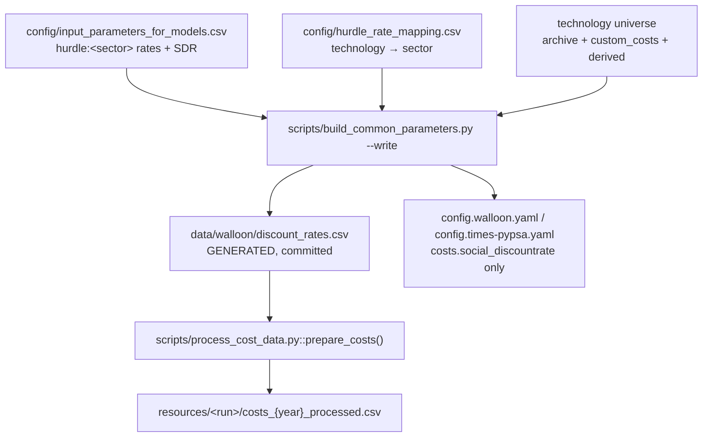

# Discount rates in PyPSA-Wal

Financial hurdle rates (WACC) and the social discount rate (SDR): how the workflow
uses them, how they are harmonised with TIMES-WAL, what the literature says about
the values, and what is still open.

**Status:** implemented. Sector hurdles and the SDR come from
[`config/input_parameters_for_models.csv`](../config/input_parameters_for_models.csv);
[`config/hurdle_rate_mapping.csv`](../config/hurdle_rate_mapping.csv) assigns them
to technologies; `data/walloon/discount_rates.csv` is generated and committed;
`process_cost_data.py` applies it. Tests in
[`test/test_discount_rates.py`](../test/test_discount_rates.py) (26).

**Last substantive change (2026-08-21):** the four sector tokens were replaced by
the **eleven `~TFM_INS` `NCAP_DRATE` process groups** of TIMES-WAL, so the mapping
is auditable line-by-line against the TIMES table ([§3](#3-the-times-table-and-the-mapping)).

| Section | |
|---|---|
| [§1](#1-the-four-rates) | vocabulary — four rates that must not be conflated |
| [§2](#2-how-the-workflow-applies-them) | pipeline, precedence, single authority, variants |
| [§3](#3-the-times-table-and-the-mapping) | the `~TFM_INS` groups and how PyPSA technologies map onto them |
| [§4](#4-decisions) | D1–D7 |
| [§5](#5-traps-where-a-per-technology-rate-is-silently-ignored) | where a rate is silently ignored |
| [§6](#6-what-the-literature-supports) | evidence for the values |
| [§7](#7-open-points) | todos |
| [§8](#8-code-locations) | where things live |

---

## 1. The four rates

| Rate | Read from | Value | What it does |
|---|---|---|---|
| **Financial discount rate** (hurdle / WACC) | `costs.hurdle_rate_fn` → the `discount rate` column of the cost table | **0.075 / 0.10 / 0.11 / 0.12** by sector; PyPSA fill **0.07** for anything unmapped | annualises overnight CAPEX into `capital_cost` (EUR/MW/a) |
| **Social discount rate** (SDR) | `costs.social_discountrate` | **0.035** | weights cost flows across investment periods — **perfect-foresight runs and post-processing only** |
| **Retrofit interest rate** | `sector.retrofitting.interest_rate` | **0.12** (RSD-RENO) | annualises building-envelope renovation. A **completely separate** annuity that never touches the cost table ([§5.2](#52-building-retrofit-uses-its-own-rate)). Inert while `retro_endogen: false` |
| **EGS rate** | the `geothermal` row of the cost table | 0.075 | enhanced-geothermal and ORC CAPEX. Used to bypass the table; fixed |

The hurdle rate reflects the **cost of capital plus the decision/behavioural
barrier** of the investor who owns the choice. The **SDR** reflects *society's*
time preference (Ramsey, `r = ρ + ηg`) and is a **single global scalar** — it is
not technology-specific and does not enter CAPEX annualisation. Conflating them
would understate private capital costs and over-build capital-intensive options.

**Administrative barriers** (permits, renovation pace, works disruption) belong in
constraints or exogenous capacity paths, **never** in a rate. That is also how
TIMES-WAL handles them.

PyPSA-Wal runs **myopic** foresight, so the optimiser does not discount between
horizons and the SDR is inert in the operational solve. It still matters for
`make_cumulative_costs.py` / `make_summary_perfect.py`: comparing cumulative costs
against TIMES at 2 % rather than 3.5 % is not comparing like with like.

---

## 2. How the workflow applies them



`calculate_annuity()` (`scripts/add_electricity.py`) takes a **pandas Series** of
rates, so per-technology annualisation needs no code change to work. PyPSA-Wal
does **not** propagate a rate onto network components — components receive
pre-annualised `capital_cost` and `lifetime` only.

### 2.1 Why two files

| File | Owner | Holds |
|---|---|---|
| `config/input_parameters_for_models.csv` | **shared** with TIMES / ICEDD | the **rates** — 11 sector hurdles + the SDR |
| `config/hurdle_rate_mapping.csv` | **pypsa-wal** | the **assignment** — one row per technology → sector, plus the `times_pset_set` audit column |

The mapping needs 307 rows, most for technologies TIMES never models
(`Container feeder, methanol`, `Zn-Br-Nonflow-store`, …). Putting them in the
shared negotiation table would bury the numbers that actually get negotiated.
Rates change with ICEDD; the assignment is a stable modelling decision.

The mapping is keyed on **real cost-table technology names**. Do **not** join on
the master CSV's `technology_name_pypsa` column — it is a human label, not a key
(`solar rooftop` vs `solar-rooftop`, `Eletricity distribution grid` [sic]). The
reliable key in the master CSV is `pypsa_wal_target`.

### 2.2 Precedence

Highest wins:

1. **Per-technology override** — an active `cost:<tech>:discount rate` target in
   the master CSV. Escape hatch for one technology that deviates from its sector.
2. **Sector rate** — `hurdle:<variant>:<sector>` when generating a named variant,
   otherwise `hurdle:<sector>`, for the technology's sector in the mapping.
3. **Fallback** — PyPSA default `costs.fill_values."discount rate"` from
   `config.default.yaml` (**0.07**). Applies only to a technology absent from the
   mapping. A safety net, **not** a scenario lever and **not** a TIMES rate.

`hurdle_sector: none` means *deliberately excluded* — no row is written. Reserved
for the eight storage aggregates and the `solar` / `waste` clones, where the rate
is provably inert ([§5.3](#53-cloned-and-derived-rows-ignore-their-own-rate)).
`none` must be **explicit**, so silence is never mistaken for a decision.

### 2.3 Single authority

`data/walloon/discount_rates.csv` is the **only** source of a per-technology
`discount rate` for the Walloon runs:

* `--check` **fails** if `custom_costs.csv` contains any `discount rate` row — two
  sources of truth would silently fight, since the generated file is applied later.
* Unlike the other four destinations this file is **generated wholesale**, not
  patched in place, so `common_parameters.md` §5.1's "never generate" principle has
  one documented exception. It is still committed, so `git diff` shows what
  changed and a run works without the script.

> **Two levers that look equivalent but do nothing.** Overriding
> `costs.fill_values."discount rate"` in a scenario has no effect on any mapped
> technology — the hurdle file is applied *after* the fill and shadows it. And
> setting `hurdle_rate_fn: null` does not give a uniform rate: the eight
> technology-data rows revert to 0.04. **A variant file is the only working lever.**

### 2.4 Scenario variants

A scenario that needs different rates does not edit the base rates. The master CSV
holds **named variants**, `--write` generates one file per variant, and a scenario
selects one through `costs.hurdle_rate_fn`.

| Target | Meaning | Generated file |
|---|---|---|
| `hurdle:<sector>` | base rate | `data/walloon/discount_rates.csv` |
| `hurdle:<variant>:<sector>` | rate for named variant | `data/walloon/discount_rates_<variant>.csv` |

A variant **inherits every sector it does not override**. Variant names must match
`[a-z0-9_]+`. Every variant file covers the **same technology list** as the base,
so a technology can never be priced in one variant and forgotten in another.

```yaml
# config/scenarios.walloon.yaml
scen_lowrate:
  costs:
    hurdle_rate_fn: data/walloon/discount_rates_lowrate.csv
```

No new machinery: `config_provider` resolves the key per-`{run}` and `scen_imppel`
already overrides a file path per scenario.

### 2.5 Error handling

| Failure | Detected by | Result |
|---|---|---|
| Technology missing from the mapping | `--check` / `--write` | named in the error, **fallback written**, exit 1 |
| Mapping sector has no rate | `--check` / `--write` | hard error, **nothing written** |
| Rate out of range (`7.5` for `0.075`) | `--check` / `--write` | hard error |
| Two sources of truth (`custom_costs.csv` DR row) | `--check` / `--write` | hard error |
| Generated file absent at run time | `process_cost_data.py` | `hurdle_rate_fn: null` → 0.07 fill, workflow still runs |
| Technology in the file but not the cost table | `process_cost_data.py` | logged warning, ignored |
| Technology in the cost table but not the file | `process_cost_data.py` | logged warning, `fill_values` fallback |
| `NaN` rate reaching the annuity | `process_cost_data.py` assert | run **aborts** — a `NaN` rate yields `NaN` `capital_cost` |
| Universe drifts from `process_cost_data.py` | test T1 | CI failure |

---

## 3. The TIMES table and the mapping

TIMES-WAL sets its hurdle rates in the `~TFM_INS` table via `NCAP_DRATE`, one row
per `Pset_Set` process group. **This is the authority** — the four-token
`production / industry / tertiary / residential` shorthand used before 2026-08-21
was a lossy summary of it.

| `Pset_Set` | `NCAP_DRATE` | pypsa-wal `hurdle_sector` | technologies | mapped |
|---|---:|---|---|---:|
| `SUP-processes` | 0.075 | `supply` | fuel supply, conversion, transport and storage; district-heating supply plant | 108 |
| `ELC-PUB` | 0.075 | `power` | public generation, HVAC/HVDC, distribution grid, electricity storage | 94 |
| `ALL-CHP` | 0.075 | `chp` | **every** CHP, whatever sector it sits in | 13 |
| `ALL-PV` | 0.075 | `pv` | **every** PV plant, whatever roof it is on | 5 |
| `TRA-processes` | 0.075 | `transport` | road vehicles, charging/refuelling infrastructure, freight ships | 42 |
| `IND-process`, `IND-processNE` | 0.10 | `industry` | industrial processes, energy and non-energy | 25 |
| `COM-processes` | 0.11 | `tertiary` | — see **D2** | **0** |
| `AGR-processes` | 0.11 | `agriculture` | — see **D4** | **0** |
| `RSD-processes` | 0.12 | `residential` | decentral building heat and its storage | 10 |
| `RSD-RENO` | 0.12 | `residential_reno` | building-envelope renovation → `sector.retrofitting.interest_rate` | config |
| `COM-RENO` | 0.11 | `tertiary_reno` | — see **D6** | config |
| — | 0.035 | SDR | `config:costs.social_discountrate` | config |

`hurdle_sector: none` (10 technologies) covers the inert rows of
[§5.3](#53-cloned-and-derived-rows-ignore-their-own-rate).

**Assignment rule.** Give each PyPSA technology the rate of the group that owns the
**investment decision**, not the sector it serves. TIMES makes two of those calls
explicitly, and they override any intuition about who lives in the building:

* **`ALL-CHP` beats the building sector.** `decentral CHP` and `micro CHP` are at
  **0.075**, not 0.12. *(This is the only rate that changed numerically in the
  2026-08-21 rework — everything else was already on the right number under a
  coarser label.)*
* **`ALL-PV` beats the roof.** `solar-rooftop`, `solar-rooftop residential` and
  `solar-rooftop commercial` are at **0.075**, the same as `solar-utility`.

Two placements are *ours*, not TIMES's, and both are recorded in the mapping's
`note` column:

* **D3** — `central *` district-heating supply plant is labelled `SUP-processes`.
  `ELC-PUB` carries the same 0.075, so the label changes no number.
* **D5** — `home battery storage` / `home battery inverter` go to `ELC-PUB`. There
  is no `ALL-BAT` group in `~TFM_INS`; the `ALL-PV` precedent (a behind-the-meter
  electricity asset priced at the supply rate) is the closest analogy. Contested by
  the literature — [§6](#6-what-the-literature-supports).

### 3.1 Regenerating

```bash
python scripts/build_common_parameters.py --write --dry-run   # preview
python scripts/build_common_parameters.py --write             # apply
git diff data/walloon/discount_rates.csv                      # review — the point of committing it
python -m pytest test/test_discount_rates.py -q
```

Adding a technology to the cost table without adding a mapping row is a soft error:
the file is still written, with the 0.07 fallback, and the run exits 1.

---

## 4. Decisions

| # | Question | Decision |
|---|---|---|
| **D1** | The master CSV's old flat 4 % vs the sectoral 7.5–12 % | **Retired.** The unmapped-technology **fallback** is the PyPSA default fill (0.07), not a TIMES rate. Sector rates live only in `hurdle:<sector>` rows. |
| **D2** | **No tertiary/residential split in the cost table** — one `decentral *` family serves both the residential and the services heat buses | **Map all `decentral *` to `residential` (0.12).** No demand-weighted blend: a blend is unauditable and cannot be reproduced from the CSV. `COM-processes` (0.11) stays defined so the table remains faithful to TIMES and a future split can use it. **Consequence: tertiary decentral heat is annualised 1 pp too high.** Fixing it needs per-sector clones of the `decentral *` cost rows and a `HeatSystem` change — see [§7](#7-open-points). |
| **D3** | Where district-heating supply plant belongs | `SUP-processes`. Numerically identical to `ELC-PUB`; recorded so the label is a decision rather than an accident. |
| **D4** | `AGR-processes` (0.11) has no PyPSA counterpart | **Defined but unused.** PyPSA-Eur models agriculture as a demand (machinery oil/electricity, `agriculture_machinery_*_share`) with no capital stock, so there is nothing to annualise. Keep the row for traceability. |
| **D5** | Home batteries and rooftop PV: prosumer or supply asset? | **Supply** (0.075), following the explicit `ALL-PV` group. Flagged, not settled — see [§6](#6-what-the-literature-supports). |
| **D6** | `sector.retrofitting.interest_rate` | **Set to 0.12** (RSD-RENO) in both Walloon configs. PyPSA holds a **single scalar**, so `COM-RENO` (0.11) cannot be expressed and the residential rate wins — Wallonia's renovation is overwhelmingly residential. **Inert while `retro_endogen: false`** (the default, and it must stay false: TIMES has already retrofitted the demand), but correct the day it is switched on. Raising it from the old 0.04 removes the inversion where renovation was cheaper to finance than the heat pump it substitutes for. |
| **D7** | PyPSA ≥ 1.1's per-component `overnight_cost` + `discount_rate` + `lifetime` API | **Not now.** Medium–high effort; `envs/environment.yaml` floors `pypsa >=0.35.2`, which predates it. Revisit only if an audit trail on the network object is required. |

### 4.1 Scenario design — when hurdle rates apply at all

Two scenarios define a **technology range** for network operators, not a point
estimate:

| Scenario | Demand | Hurdle rates |
|---|---|---|
| **Demande maîtrisée / transition PACE** | full implementation of demand-side policies | **none** in either model — barriers assumed removed by policy |
| **Trajectoire réaliste** | high demand | **applied** in both models |

The gap gives (1) a min–max range per technology for grid planners and (2) a
quantification of the upside from de-risking mechanisms (e.g. CfDs from work
package 2). Both must be runnable **side by side** — the gap *is* the deliverable —
so neither can be expressed by editing the base rates. Use a variant
([§2.4](#24-scenario-variants)). A rate of **0** is never used: the annuity
collapses to `1/lifetime`, i.e. free capital.

### 4.2 Who invests in what

| Model | Scope | Foresight |
|---|---|---|
| **TIMES** | **demand** — vector choice, consumption technologies (heat pumps, boilers, EVs, district heating), renovation | perfect foresight on vector arbitrage |
| **PyPSA** | **electricity supply** — utility and rooftop PV, wind, batteries, nuclear, grids | myopic; dispatch, interconnectors |

TIMES optimises demand-side investment and fuel switching; decentral heating
capacities and electrification levels are **imposed on PyPSA** from TIMES outputs
([`heat-softlink.md`](heat-softlink.md)). Note the interaction: **once a
technology's capacity is imposed exogenously, its hurdle rate no longer changes
the build decision — only the reported cost.** Under the live option-B′ heat
soft-link that applies to all decentral heat, which is exactly where the 0.12 rate
sits.

---

## 5. Traps: where a per-technology rate is silently ignored

### 5.1 `config: costs: overwrites:` cannot set a discount rate

The overwrite loop in `process_cost_data.py` whitelists only `investment`,
`lifetime`, `FOM`, `VOM`, `efficiency`, `fuel`, `standing losses`. A
`costs: overwrites: {"discount rate": {...}}` block — including from
`config/scenarios.walloon.yaml` — is **silently discarded**, with no warning.

### 5.2 Building retrofit uses its own rate

`scripts/build_retro_cost.py` reads `sector.retrofitting.interest_rate` and applies
its own annuity. This never touches the cost table, so **no `custom_costs.csv` or
hurdle-file row can reach it** — hence D6 being a config change.

### 5.3 Cloned and derived rows ignore their own rate

| Row | Why | Consequence |
|---|---|---|
| `solar` | `capital_cost` copied from `solar-utility` | giving `solar` a rate has **no effect** |
| `waste` | whole row cloned from `waste CHP`, *after* the annuity | inherits `waste CHP`'s rate **and** its `capital_cost` |
| `battery`, `li-ion`, `lfp`, `vanadium`, `lair`, `pair`, `iron-air`, `H2` | created *after* the fill | `discount rate` stays `NaN`; `capital_cost` is summed from component rows, which carry their own rates |

These ten are the `hurdle_sector: none` set. They are harmless, but they mean a
naive "every row must have an explicit rate" invariant **will fail** unless they
are excluded deliberately — which is what the `none` label does.

### 5.4 Direct `capital_cost` overrides bypass the annuity

If `custom_costs.csv` sets `capital_cost` for a technology, the rate is irrelevant
for that row. Do not override both.

### 5.5 `technology: all` in `custom_costs.csv` is a blanket overwrite

It rewrites **every** technology, flattening whatever the hurdle file wrote. Use
`planning_horizon: all` freely; use `technology: all` with care.

---

## 6. What the literature supports

Evidence base for the *values*. It informs the numbers in the shared CSV; it is
**not** an input to the workflow above.

### 6.1 Verdict per rate

| Our rate | Supports | Challenges |
|---|---|---|
| **`SUP` / `ELC` / `CHP` / `PV` / `TRA` 7.5 %** | PRIMES REF2016 grids / FiT RES / public transport **7.5 %**; competitive supply **8.5 %**; IEA/NEA *Projected Costs* (2020) flat **7 %**; PyPSA-Eur default **7 %** | bankable EU RES often **3.5–6 %**; IRENA Europe WACC **~3.8 %** (2024 data); Fraunhofer ISE 2024 real: onshore **3.9 %**, utility PV **3.5 %**, rooftop **3.2 %**, offshore **6.0 %**; regulated grids **3–6 %** |
| **`IND` 10 %** | older PRIMES industry **12 %**; heavy-industry band **10–12 %**; IEA up to **15 %** | PRIMES energy-intensive **7.5 %** / non-EI **9 %**; French firm median **~8 %** |
| **`COM` 11 %** | **exact PRIMES services rate** | pure-WACC surveys ~**8 %**; unused in our mapping today (D2) |
| **`RSD` 12 %** | **exact PRIMES renovation/heating rate** (with EE policies) | financial household cost of capital **3–6 %** (Steinbach 2015); implicit discount rates often **15–30 %+**; French median **~10 %** |
| **SDR 3.5 %** | UK Green Book STPR **3.5 %**; mid-range of European practice (NL 2.25 % – EU IA 4 %); Belgian OLO rationale | France Stratégie now **~3.2 %**; NL **2.25 %**; ENTSO-E CBA **4 %**; TIMES-Wal academic Ramsey **1.8 %**; climate-ethics arguments for **1–2 %** |

**Overall reading:** the ladder is a **PRIMES-compatible private decision / hurdle
schedule**, not a set of engineering WACCs and not full behavioural IDRs. That is a
coherent modelling choice, and it should be documented as such rather than
defended as market cost of capital. The production rate is deliberately **above**
observed European RES project finance.

Two macro caveats: most European models historically used a single **5–8 %** rate,
so differentiating by investor sector is closer to PRIMES than to classic PyPSA;
and post-2022 rate rises moved analytical WACCs up (IEA's illustrative WACC 4.5 %
→ 5.5 %; WEO/GEC OECD default plant WACC to ~9 % real pre-tax). Fixed model
hurdles should be revisited when macro conditions shift.

### 6.2 The two assignment tensions that survive

The 2026-08-21 rework **resolved** two of the four tensions the earlier review
raised, because TIMES states them explicitly rather than leaving them to us:
retrofit is no longer at 4 % (D6), and CHP is no longer priced by the building it
sits in. Two remain:

1. **Household cars at 7.5 % (`TRA-processes`).** PRIMES puts private passenger
   cars at **11 %** (older IA material: 17.5 %), business freight/HGV at **9.5 %**,
   charging infrastructure at **8.5 %**; JRC Haq & Weiss (2018) find implicit rates
   of **19 ± 17 %** for efficient transport durables. Leaving cars at 7.5 % while
   residential heat pumps sit at 12 % **favours vehicle electrification over
   building electrification for purely discount-rate reasons**. Defensible only if
   transport CAPEX is read as **fleet/operator** investment (leasing, company cars,
   logistics) rather than household purchase. It is a TIMES decision, so the place
   to raise it is the shared table, not the mapping.
2. **Rooftop PV and home batteries at 7.5 % (`ALL-PV`, D5).** Same argument: if the
   household is the decision-maker for the heat pump *and* the panel, consistency
   argues for the residential rate. If rooftop is a generation asset with
   power-sector financing — the TIMES supply convention — 7.5 % is coherent, but
   the assumption must stay explicit. Note Fraunhofer measures small rooftop at
   **3.2 %** real and PV+battery packages at **2.2–2.5 %**, i.e. *below* utility
   scale, which cuts the other way.

A third, milder one: a **single 7.5 % for both CfD-backed mature RES (~4 %) and
FOAK PtX/CCS (~8–10 %)** compresses a real risk spread.

### 6.3 Priority sensitivity variants

Via `hurdle:<variant>:<sector>` ([§2.4](#24-scenario-variants)):

| Variant | What it tests |
|---|---|
| `lowrate` | all groups near the SDR (~3.5 %) — the social-planner counterfactual, and the "barriers removed by policy" scenario of [§4.1](#41-scenario-design--when-hurdle-rates-apply-at-all) |
| `market_res` | `power`/`pv` at 4–5 % (the IRENA/Fraunhofer cluster) — impact of bankable mature-RES finance |
| `resid09` / `resid15` | residential 9 % vs 15 % — bounds the heat-pump vs gas-boiler arbitrage |
| `car11` | `transport` at 11 % (PRIMES household cars) — tests tension 1 above |

Dimitri Krings (Climact) noted that a December 2025 test with higher uniform rates
had a **strong impact** (sharp drop in renewables). Expect re-alignment to move
results materially.

### 6.4 Key sources

*Flagship and official:* IEA/NEA *Projected Costs of Generating Electricity* (2020)
· IEA *WEO* / Global Energy and Climate Model (2024, incl. corrigendum) · IEA
*Renewable Market Update* · IRENA *Renewable Power Generation Costs in 2024* (2025)
· UK HM Treasury *Green Book* · EU Better Regulation impact-assessment guidance ·
France Quinet (2013) and France Stratégie climate updates (2021–25) · Netherlands
Discount Rate Working Group (2020) · Germany UBA *Methodological Convention* ·
EPBD cost-optimality delegated regulation · ENTSO-E CBA guideline · PRIMES / EU
Reference Scenario 2016 and 2020.

*Scientific:* Steffen (2020) *Estimating the cost of capital for renewable energy
projects* · Egli, Steffen & Schmidt on cost-of-capital dynamics · Polzin et al.
(2021) · Fraunhofer ISE *Stromgestehungskosten* (2024) · DiaCore/Ecofys (2016) RES
WACC survey · Steinbach & Staniaszek (2015, BPIE/Fraunhofer ISI) · Haq & Weiss
(JRC, 2018) on implicit discount rates.

*Model context:* Meurisse et al. (2022, *Energy Policy*) TIMES-Wal — Ramsey 1.8 %,
no hurdles · PATHS2050 / TIMES-BE (EnergyVille, 2023) — 3 %, sector hurdles
disabled · PyPSA-Eur `technology-data` v0.14.0.

---

## 7. Open points

| # | Open point | Blocks |
|---|---|---|
| 1 | **`COM-processes` (0.11) reaches nothing** (D2). Services decentral heat is annualised at the residential 0.12. Fixing it needs per-sector clones of the `decentral *` cost rows (`services decentral air-sourced heat pump`, …) plus a `HeatSystem.heat_pump_costs_name` change — a real refactor for a 1 pp effect on one sector. **Decide whether it is worth it.** | fidelity of tertiary heat costs |
| 2 | **Household cars and rooftop PV/home batteries** ([§6.2](#62-the-two-assignment-tensions-that-survive)). TIMES decisions, so raise them in the shared table. A `car11` variant quantifies the first before anyone argues about it. | comparability with PRIMES |
| 3 | **`retro_endogen` must stay `false`** and the 0.12 is therefore inert. If a renovation study is ever wanted, the double count against TIMES's already-retrofitted demand has to be resolved first ([`heat-softlink.md`](heat-softlink.md) §7). | a renovation study |
| 4 | **The result impact of the 2026-08-21 change has not been quantified.** Only `decentral CHP` and `micro CHP` moved (0.12 → 0.075), and neither is built in the current chain under option B′ — but that has not been *verified* on a solved network. Check `micro_chp: false` still holds and confirm no CHP capacity appears on a decentral bus. | publishing the change |
| 5 | **`prepare_costs()` is awkward to call outside Snakemake** — it reads the `snakemake` global for `custom_costs` and `planning_horizon` instead of its own parameters. The tests work around it. Cosmetic, but it will bite the next test author. | test ergonomics |
| 6 | **Heating cost assumptions are unreconciled with TIMES** (`custom_costs.csv` has no decentral heating rows). If PyPSA's heat pumps are cheaper or its gas dearer than TIMES's, part of the mix divergence is a parameter inconsistency and the hurdle rate is not the lever. Shared with [`heat-softlink.md`](heat-softlink.md) §8. | the credibility of both couplings |

---

## 8. Code locations

| Topic | Location |
|---|---|
| Annuity | `scripts/add_electricity.py` `calculate_annuity()` |
| Cost processing, per-tech rate column | `scripts/process_cost_data.py` `prepare_costs()` |
| Generator / validator | `scripts/build_common_parameters.py` (`HURDLE_SECTORS`, `resolve_hurdle_rates`, `patch_discount_rates`) |
| Standing decision notes | `scripts/apply_common_parameters_decisions.py` `NOTE_DISCOUNT` |
| `costs:` config block | `config/config.default.yaml`; Walloon override `config/config.walloon.yaml` |
| Config schema | `scripts/lib/validation/config/costs.py` |
| Snakemake cost rule | `rules/build_electricity.smk` `rule process_cost_data` |
| Storage aggregate lookup | `scripts/add_electricity.py` `STORE_LOOKUP` |
| EGS rate (now reads the `geothermal` row) | `scripts/prepare_sector_network.py` `add_enhanced_geothermal()` |
| Retrofit interest rate | `scripts/build_retro_cost.py`; config `sector.retrofitting.interest_rate` |
| Perfect-foresight SDR | `scripts/prepare_perfect_foresight.py`; `sdr+XX` wildcard in `scripts/_helpers.py` |
| Tests | `test/test_discount_rates.py` |
| Related | [`../common_parameters.md`](../common_parameters.md) §3.6/§5 · `doc/costs.rst` · [`network-representation-analysis.md`](network-representation-analysis.md) §4 |
