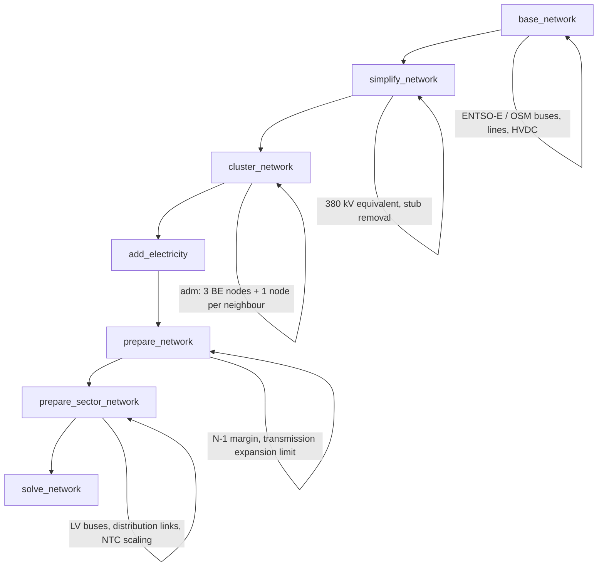
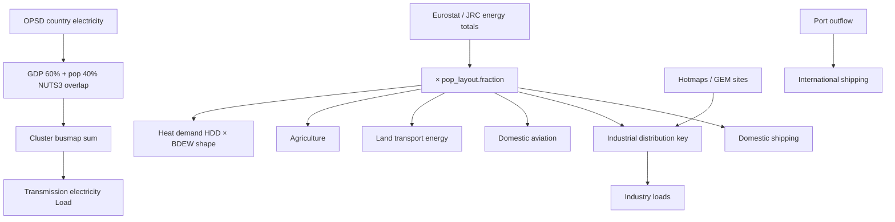
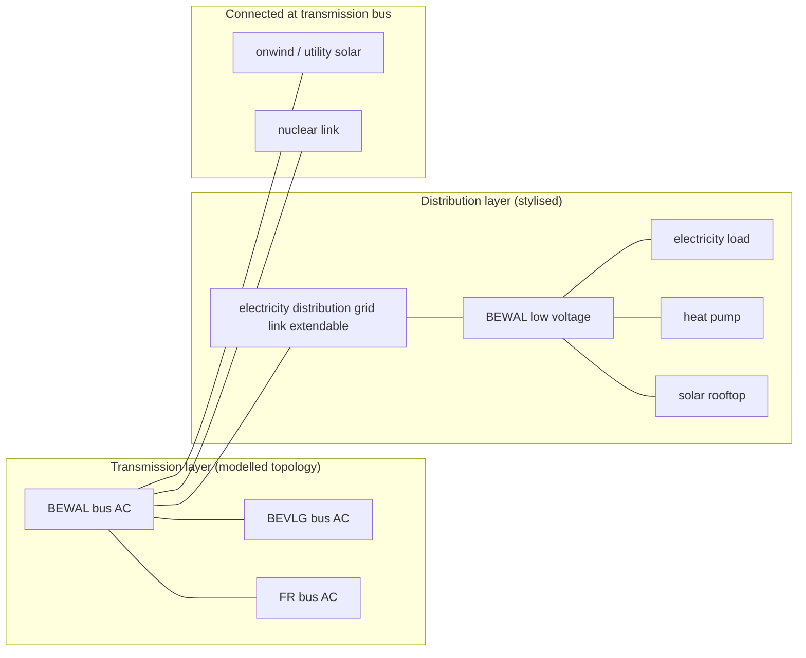

# Electricity network representation in PyPSA-Wal

This note reviews how the **transmission** and **distribution** grids are represented in the PyPSA-Wal model (a soft-fork of PyPSA-Eur / PyPSA-Eur-Sec), based on the documentation, configuration files, and source code. It ends with concrete extension plans for (1) a finer transmission grid and (2) better distribution bottlenecks.

---

## 1. Scope and vocabulary

| Layer | Voltage (typical) | What the model includes |
|-------|-------------------|-------------------------|
| **Transmission** | ≥ 220 kV AC + HVDC | Full topology (before clustering), lines/links with capacities, expansion, losses, NTC constraints |
| **Distribution** | ≤ 110 kV down to LV | **No topology**; one aggregate link per node between transmission and low-voltage buses |

PyPSA-Eur was designed as a **European transmission** model. Sector coupling (PyPSA-Eur-Sec) adds a stylised **distribution interface** so that decentralised technologies can be connected at low voltage without building a full MV/LV mesh.

---

## 2. End-to-end workflow

The electricity network is built in several Snakemake stages:



### 2.1 Base network (`scripts/base_network.py`)

- **Data source**: ENTSO-E Transmission System Map (GridKit extract) or OpenStreetMap (`electricity.base_network` in config; default `osm-prebuilt`).
- **Components**: AC buses, HVAC lines, HVDC links, transformers (later removed in simplification).
- **Voltage filter**: Only buses within `electricity.voltages` (default `[220, …, 750]` kV).
- **Line parameters**: `s_nom` from map data; types mapped from voltage (`config/lines.types`); **N-1 security margin** via `lines.s_max_pu = 0.7` (70% of thermal limit usable).
- **Spatial attachment**: Voronoi regions around substations for renewable potentials and load upscaling (`doc/preparation.rst`, `doc/limitations.rst`).

**Limitation (documented)**: Map geometry is approximate; impedances are inferred from length and standard types; no switchgear, reactive compensation, or DSO topology (`doc/limitations.rst`).

### 2.2 Simplification (`scripts/simplify_network.py`)

1. **Single voltage layer**: All AC lines mapped to **380 kV** equivalent; transformers removed; connected components merged (`simplify_network_to_380`).
2. **HVDC folding**: Multi-hop DC paths between two AC buses collapsed to one link.
3. **Stub removal**: Dead-end lines/links removed.

Capacity is preserved (`s_nom` recalculated from type and `num_parallel`), but topological detail below 380 kV is lost.

### 2.3 Clustering (`scripts/cluster_network.py`)

Spatial resolution is controlled by `clustering.mode` and the `{clusters}` wildcard.

**Default PyPSA-Eur**: k-means on substations → tens to hundreds of nodes per Europe.

**PyPSA-Wal** (`config/config.walloon.yaml`):

```yaml
scenario:
  clusters:
  - adm
clustering:
  mode: custom_busmap_BE
```

Walloon-specific busmap (`scripts/custom_busmap_for_BE.py`, rule `build_custom_BE_busmap` in `rules/walloon.smk`):

| Region | Cluster bus |
|--------|-------------|
| Wallonia | `BEWAL` |
| Flanders | `BEVLG` |
| Brussels | `BEBRU` |

- Belgian substations are assigned by point-in-polygon against `data/walloon/be.json`.
- **All non-Belgian substations** in the modelled countries map to their **ISO-2 country code** (`FR`, `DE`, `NL`, `GB`, `LU`) — i.e. one transmission node per neighbour country.

After clustering, PyPSA aggregates lines between clusters (sum of `s_nom`, mean length, etc.). **Internal mesh within each cluster disappears**; only inter-cluster links remain.

**Power plant reassignment** (`scripts/walloon_scripts/custom_clustering.py`, enabled by `electricity.walloon_reassignment: True`): Belgian plants in `build_powerplants` are assigned to `BEWAL` / `BEVLG` / `BEBRU` by location.

**Optional copperplating** (`copperplate_buses` in `cluster_network.py`): Replaces intra-zone branches with infinite-capacity `"copper"` links. Default `clustering.copperplate_regions: []` (disabled in Walloon config).

### 2.4 Electricity layer (`scripts/add_electricity.py`, `scripts/prepare_network.py`)

**`add_electricity`** attaches to the clustered network:

- Existing and extendable generators (renewables, OCGT/CCGT, …).
- Load time series upsampled from country totals using population/GDP (`scripts/build_electricity_demand_base.py`).
- Storage (battery, H2) if configured.
- **Transmission expansion costs** on lines (`HVAC overhead`) and HVDC links (`set_transmission_costs`).

**`prepare_network`** (electricity-only step):

- Maintains `s_max_pu = 0.7` (N-1).
- **Transmission expansion cap** via `electricity.transmission_limit`:
  - Walloon: `v1.0` → total new transmission **volume** ≤ 100% of reference (sum of `s_nom × length` for AC + DC).
  - Myopic overrides: 2040/2050 → `v1.1` (10% volume expansion allowed).
  - Prefix `v` = volume limit; `c` = cost limit; `opt` = free expansion with existing capacity as floor.
- Per-line caps: `lines.max_extension` / `links.max_extension` (default 20 GW / 30 GW).
- Optional autarky (remove cross-border branches).

**Planned grid** (`transmission_projects`, `scripts/build_transmission_projects.py`, `add_transmission_projects_and_dlr.py`): TYNDP, NEP, manual projects added before clustering; optional dynamic line rating.

### 2.5 Sector coupling layer (`scripts/prepare_sector_network.py`)

This is where **transmission vs distribution** diverge in practice.

#### Transmission-related options (defaults in `config/config.default.yaml`)

| Config key | Default | Effect |
|------------|---------|--------|
| `sector.electricity_transmission_grid` | `true` | Keep AC lines and HVDC links |
| `sector.transmission_efficiency` | DC, H2, gas, **distribution grid** | Split bidirectional links for losses (`lossy_bidirectional_links`) |
| `solving.options.transmission_losses` | `2` | AC line loss linearisation order in optimisation |

Setting `sector_opts` wildcard `decentral` disables the transmission grid entirely (`decentral()` drops all lines and DC links).

#### Distribution grid (`insert_electricity_distribution_grid`)

Enabled by default (`sector.electricity_distribution_grid: true`). Implementation:

1. For each AC node `N`, add bus `N low voltage` (carrier `low voltage`).
2. Add extendable link `N electricity distribution grid` (`bus0=N`, `bus1=N low voltage`, bidirectional).
3. **Re-home loads and decentralised tech** to LV:
   - Electricity loads (incl. industry electricity, agriculture).
   - BEV chargers, V2G, heat pumps, resistive heaters, micro-CHP.
4. **Rooftop PV** and **home batteries** are added on LV (utility solar stays on transmission bus).
5. Optional **static distribution losses** (3%): demand scaled by `efficiency_static: 0.97` before optimisation.
6. Investment cost from technology-data (`electricity distribution grid`, ~500 €/kW cited in `doc/spatial_resolution.rst`); adjustable via `adjustments.sector.factor.Link.electricity distribution grid.capital_cost` or wildcard `dist` / `dist0.5` etc.

**What is *not* modelled**:

- MV/LV lines, feeders, transformers, radial constraints.
- Geographic routing inside a node.
- Hosting capacity curves by municipality.
- Symmetric treatment of export bottlenecks (only aggregate exchange capacity is optimised).

**Related stylised costs**:

- `sector.electricity_grid_connection`: adds connection cost to utility wind/solar on transmission bus.
- `sector.gas_distribution_grid`: adds a fraction of electricity DSO cost to decentralised gas boilers / micro-CHP.

---

## 3. Walloon-specific transmission settings

From `config/config.walloon.yaml`:

```yaml
countries: [BE, FR, GB, NL, DE, LU]
electricity:
  transmission_limit: v1.0
  transmission_limit_myopic:
    2030: v1.0
    2040: v1.1
    2050: v1.1
  apply_ntc_constraints: True
```

### 3.1 NTC constraints (`scripts/walloon_scripts/set_NTCs.py`)

Called at the **end** of `prepare_sector_network` when `apply_ntc_constraints: True`, using `data/walloon/ntc_2030.csv`.

For each country pair (ISO-3 → ISO-2, e.g. BEL–DEU):

1. Sum existing cross-border **DC link** capacities (each direction separately) **or**, if no DC, sum **AC line** `s_nom`.
2. Scale all parallel interconnections uniformly so the **total equals the target NTC** (MW).
3. If DC links exist, **remove parallel AC lines** between the same pair (avoid double counting).

**Important modelling implications**:

- NTC is enforced at **country-pair** level, not BEWAL–FR or BEWAL–DE level.
- Belgian regions share one national NTC bucket (buses retain `country == 'BE'` while index is `BEWAL` etc.).
- Capacities are scaled, not re-routed; internal Belgian topology is already collapsed to three nodes.
- File is labelled 2030 but applied across myopic horizons unless extended.

Example entries relevant to Belgium (MW, symmetric pairs in file):

| Pair | NTC_2030_MW |
|------|-------------|
| BEL–DEU | 1000 |
| BEL–FRA | 2800–4300 (duplicate rows averaged) |
| BEL–GBR | 2400 |
| BEL–LUX | 680 |
| BEL–NLD | 3400 |

**Data source note:** Cross-border NTC values come from `data/walloon/ntc_2030.csv`, documented as European country-pair NTCs for 2030 (aligned with TYNDP-style figures in `doc/data-walloon.rst`), **not** from Elia.

### 3.2 Elia data in the current workflow

A codebase search shows **no Elia grid data** (topology, line ratings, hosting capacity, or official NTC publications) is ingested anywhere in the Snakemake workflow. The transmission mesh is built from the generic PyPSA-Eur **ENTSO-E / OSM** extract (`scripts/base_network.py`), then simplified and clustered as described above.

The **only** Elia-related input today is indirect: aggregated solar capacity bounds in `data/agg_p_nom_minmax.csv` (`BE,solar-all` and `BEWAL,solar-all`), where the BEWAL values are documented in `doc/data-walloon.rst` as coming from Climact based on the **Elia ADEXFLEX** study — a RES potential ceiling, not a network model.

### 3.3 Power flow vs NTC modelling approach (current)

The current analysis uses **both** concepts, but at different levels:

| Aspect | What the model does |
|--------|---------------------|
| **Cross-border limits** | **NTC-style capacity caps** — before the solve, `set_line_s_nom_to_ntc` scales (or sets) the sum of border line/link capacities to match country-pair NTC values. There is no separate NTC market-coupling algorithm or flow-based NTC computation at runtime. |
| **Within-network dispatch** | **Linear Optimal Power Flow (LOPF)** — `scripts/solve_network.py` calls PyPSA `network.optimize()`, which solves a **linearised** DC-style OPF on AC lines (susceptance-based) plus transport-model HVDC links, **not** a full AC Newton–Raphson power flow. |
| **Losses** | Optional AC loss linearisation (`solving.options.transmission_losses: 2` in default config); HVDC losses via `lossy_bidirectional_links` when enabled in `sector.transmission_efficiency`. |
| **Security** | Thermal headroom only: `lines.s_max_pu = 0.7` (~N‑1 margin on nominal capacity). No contingency-constrained OPF or PTDF-based branch limits (`electricity.operational_reserve.activate` is `false` by default). |

In short: **NTC defines border capacity envelopes; LOPF (linearised, not AC power flow) dispatches power subject to those limits.** This is a **transport/capacity** representation at borders combined with a **nodal linear OPF** internally — consistent with the TYNDP transport-model philosophy noted in `doc/release_notes.rst` (KVL neglected on HVDC links).

---

## 4. Key quantitative assumptions (grids)

Default values below come from `config/config.default.yaml` plus `config/config.walloon.yaml` overrides where noted. Investment figures are from **PyPSA `technology-data` v0.13.3** (`costs.year: 2050`), processed by `scripts/process_cost_data.py`. Overnight CAPEX is annualised with **discount rate 7%**, **lifetime 40 years**, **FOM 2%/a** (unless overridden per technology). PyPSA `capital_cost` is in **€/MW/a** (or **€/kW/a** for per-kW technologies) for one modelled investment period (`nyears = 1` in `prepare_costs`).

Walloon config uses `costs.custom_cost_fn: data/walloon/custom_costs_rc.csv` for fuels and selected technologies; **grid cost rows are not overridden there** — transmission and distribution grid costs follow `technology-data`.

### 4.1 Investment costs

| Component | Overnight investment (CAPEX) | Annualised `capital_cost` in the model | How it enters the network |
|-----------|---------------------------|----------------------------------------|---------------------------|
| **HVAC transmission line** | **442 €/MW/km** | **~42 €/MW/km/a** | `capital_cost = length × 1.25 × 42` on each `Line` (`lines.length_factor: 1.25`) |
| **HVDC overhead** | **442 €/MW/km** | **~42 €/MW/km/a** | Same €/km as HVAC for overhead fraction of DC links |
| **HVDC submarine** | **1 008 €/MW/km** | **~96 €/MW/km/a** | Weighted by `underwater_fraction` on DC links |
| **HVDC converter pair** | **166 000 €/MW** (per direction) | **~15 750 €/MW/a** | Fixed add-on per DC link (`HVDC inverter pair`) |
| **Electricity distribution grid** | **529 €/kW** | **~50 €/kW/a** (~500 €/kW/a often cited in docs after rounding) | Fixed `capital_cost` on extendable link `{node} electricity distribution grid`; adjustable via `adjustments.sector.factor.Link.electricity distribution grid.capital_cost` (default **1.0**) or wildcard `dist{factor}` |
| **Utility RES grid connection** | **148 €/kW** | **~14 €/kW/a** | Added to `capital_cost` of onshore wind / utility solar / solar-hsat when `sector.electricity_grid_connection: true` |
| **Gas distribution (stylised)** | — | **~50 €/kW/a × 1.0** | Same annualised DSO cost added to decentralised gas boilers and micro-CHP (`gas_distribution_grid_cost_factor: 1.0`) |

**Distribution losses** (optional): if enabled in `sector.transmission_efficiency`, static efficiency **97%** on the distribution link (`efficiency_static: 0.97`); electricity demand is pre-scaled accordingly.

**HVDC / pipeline losses** (when enabled): DC static **98%**, **0.977 per 1000 km**; gas compression **1%/1000 km** (see `sector.transmission_efficiency`).

### 4.2 Expansion limits (“ramping” of grid capacity)

The model does **not** impose an explicit **MW/year build-rate** or inter-period ramp on grid assets. Expansion is constrained as follows:

#### Transmission (Walloon config)

| Constraint | Default config | Walloon override | Effect |
|------------|----------------|------------------|--------|
| **Global volume cap** | `transmission_limit: vopt` (free expansion) | **`v1.0`** (2030), **`v1.1`** (2040, 2050) | **`v1.0`**: total AC+DC volume-length product ≤ **100%** of reference; **lines/HVDC not set extendable** (`factor` must be `opt` or **> 1.0**). **`v1.1`**: cap at **110%** of reference; branches become **extendable** between `s_nom_min` and cap. |
| **Per-line HVAC extension** | `lines.max_extension: 20 000 MW` | (same) | If extendable: `s_nom_max = s_nom + 20 000 MW` per line (`limit_individual_line_extension`) |
| **Per-link HVDC extension** | `links.max_extension: 30 000 MW` | (same) | If extendable: `p_nom_max = p_nom + 30 000 MW` per DC link |
| **Global branch ceiling** | `lines.s_nom_max: ∞`, `links.p_nom_max: ∞` | (same) | No country-wide MW cap beyond the rules above |
| **Cross-border capacity** | — | **`apply_ntc_constraints: True`** | Border `s_nom` / `p_nom` **scaled to NTC** (`data/walloon/ntc_2030.csv`); not an expansion rate but a **fixed capacity envelope** |
| **Post-optimisation discretisation** | `post_discretization.enable: false` | (same) | If enabled: build in chunks of **1 700 MW** (HVAC), **2 000 MW** (HVDC) |

Reference volume for `v*` limits uses existing `s_nom × length` (× **1.25** length factor) plus HVDC `p_nom × length`.

#### Distribution

| Constraint | Value | Effect |
|------------|-------|--------|
| **Extendable** | `p_nom_extendable: true` | Optimiser may build LV coupling capacity at each node |
| **Maximum capacity** | **No default `p_nom_max`** | Unlimited unless user adds hosting-cap data or config adjustments |
| **Build rate** | — | **None**; full capacity can appear in one investment period |

### 4.3 Other grid-related constraints

| Category | Parameter | Default | Notes |
|----------|-----------|---------|-------|
| **Thermal / N‑1 headroom** | `lines.s_max_pu` | **0.7** | Usable capacity = 70% of `s_nom` (approximate N‑1 margin) |
| **HVDC utilisation** | `links.p_max_pu` | **1.0** (±1.0 bidirectional) | Full rating unless DLR active |
| **AC loss model** | `solving.options.transmission_losses` | **2** | Second-order loss linearisation in LOPF |
| **Operational reserve** | `electricity.operational_reserve.activate` | **false** | If true: +2% load + 2% VRES reserve + **4 000 MW** contingency |
| **Autarky** | `electricity.autarky.enable` | **false** | Can remove all or only cross-border lines/links |
| **Existing line policy** | `lines.under_construction` | **keep** | Projects under construction kept at full capacity |
| **Dynamic line rating** | `lines.dynamic_line_rating.activate` | **false** | Optional time-varying `s_max_pu` from weather |
| **Myopic brownfield** | per horizon | Walloon `v1.0` / `v1.1` | `add_brownfield` re-applies `set_transmission_limit` each planning year |
| **Generator growth limits** | `sector.limit_max_growth` | **false** | If enabled: e.g. max **+30%** relative to historic peak build (`factor: 1.3`) — applies to **generators**, not grid |

---

## 5. Spatial resolution and geographic allocation of loads

### 5.1 Node geography (Walloon run)

| Aspect | Resolution in default Walloon run (`clusters=adm`) |
|--------|-----------------------------------------------------|
| Belgium transmission | **3 nodes** (BEWAL, BEVLG, BEBRU) |
| Neighbour countries | **1 node each** (FR, DE, NL, GB, LU) |
| **Total AC transmission nodes** | **~8** |
| Internal 380 kV mesh (e.g. Wallonia) | Aggregated; only **inter-regional** links kept |
| Cross-border topology | One (or few) aggregated tie(s) per country pair, then NTC-scaled |
| Distribution | **1 extendable link per transmission node** (8 links total) |

Documented warnings (`README.md`, `doc/limitations.rst`): assigning load and generation to transmission nodes via Voronoi / overlap rules ignores real DSO topology; **local bottlenecks can be underestimated** unless distribution links bind.

### 5.2 Common spatial basis

Most sector loads share the same **nodal population layout** (`build_clustered_population_layouts.py`):

1. **NUTS3 population and GDP** (`build_population_layouts.py`, `data/` NUTS3 shapes) are rasterised onto the **atlite cutout grid** (ERA5/SARAH cells).
2. **Urban / rural split** uses World Bank urbanisation rates per country; within each country, grid cells are sorted by population density to assign urban vs rural population.
3. For each **clustered onshore region** (transmission node polygon from `regions_onshore`), an **indicator matrix** sums grid-cell population falling inside the polygon.
4. Each node gets:
   - `total`, `urban`, `rural` population;
   - `ct` = ISO-2 country prefix (for BEWAL this is still **`BE`**, from bus naming);
   - **`fraction`** = node population / country population (sums to 1 per country).

**Country-level energy balances** come from Eurostat / JRC / IDEES via `build_energy_totals.py`. `build_population_weighted_energy_totals.py` distributes them to nodes:

```text
nodal_total[bus] = country_total[bus.ct] × pop_layout.fraction[bus]
```

So for any sector using `pop_weighted_energy_totals`, the driving variable is **population share within the country**, unless a sector-specific key overrides it (industry, heat shape, transport).

After **Belgian admin clustering**, all substations in Wallonia are merged onto **BEWAL**: electricity load built at substation level is **summed** (`add_electricity.attach_load` via `busmap`), and population-based keys use the **BEWAL region polygon** (share of Belgian population in Wallonia).

### 5.3 Electricity demand (transmission `Load`)

| Step | Script | Driving variables | Spatial rule |
|------|--------|-------------------|--------------|
| Country time series | `build_electricity_demand.py` | **OPSD / ENTSO-E** hourly load per country | None (country columns) |
| Downscale to base regions | `build_electricity_demand_base.py` | Country load × **weighted mix of GDP and population** | Overlap of each **substation Voronoi region** with **NUTS3** polygons: `0.6 × norm(GDP) + 0.4 × norm(pop)` (`load.distribution_key`) |
| Cluster + attach | `add_electricity.py` → `attach_load` | Same hourly shape | **`busmap` sum** → one profile per cluster (BEWAL, FR, …) |
| Scaling | config `load.scaling_factor` | Uniform multiplier (default **1.0**) | All nodes |

**Important:** every node in a country receives the **same normalised hourly shape**; only **magnitude** differs (via GDP/pop before clustering, via busmap sum after). There is **no node-specific load shape** for electricity at transmission level.

Non-electric heating in the Eurostat “electricity” balance is **removed** when the heat sector is built (`build_heat_demand` subtracts electric heating from `loads_t.p_set`).

### 5.4 Space and water heating

| Step | Script | Driving variables | Spatial rule |
|------|--------|-------------------|--------------|
| Daily heat (HDD) | `build_daily_heat_demand.py` | **Ambient temperature** (cutout) → heating degree days via **atlite** | Population matrix **`M`** maps grid cells to clustered regions (same pop layout as above) |
| Hourly profile | `build_hourly_heat_demand.py` | **BDEW** weekday/weekend intraday profiles (residential / services, space / water) | Same shape for all nodes; normalised |
| Nodal magnitudes | `prepare_sector_network.build_heat_demand` | **`pop_weighted_energy_totals`**: `total {residential\|services} {space\|water}` and country **heating efficiencies** (Eurostat / BDEW) | Energy ∝ **population fraction**; hourly shape from HDD × BDEW |
| District heating share | `build_district_heat_share.py` | Country DH share (Eurostat) × **urban population** within country × **`sector.district_heating.potential`** and **progress** by year | More DH in **urban** nodes |

Temperature-driven **HDD** introduces **weather co-variation** across nodes (same cutout, different regional averages), but **annual energy totals** are still population-weighted.

### 5.5 Land transport (BEV / ICE / FCEV)

| Step | Script | Driving variables | Spatial rule |
|------|--------|-------------------|--------------|
| Activity shape | `build_transport_demand.py` | **German passenger-car traffic** weekly profile (2010–2015) | Identical shape all nodes |
| Energy total | `pop_weighted_energy_totals` | **`total road` + `total rail` − `electricity rail`** (Eurostat, × `nyears`) | × **`pop_layout.fraction`** per node |
| Fleet size | `build_transport_demand.build_nodal_transport_data` | Country **number of cars** × **`pop_layout.fraction`** | Sets BEV charger `p_nom` |
| Technology split | config `land_transport_{electric,ice,fuel_cell}_share` | **Exogenous** share by planning horizon | Same share in all nodes of a country |

Driving demand is **population-allocated road/rail energy**; charger capacity scales with **cars × electric share**. No explicit spatial road network.

### 5.6 Industry

Two layers: **site-based keys** and **country material balances**.

**Distribution keys** (`build_industrial_distribution_key.py`):

| Subsector | Primary spatial driver | Fallback |
|-----------|------------------------|----------|
| Most Hotmaps subsectors (steel, chemicals, paper, …) | **ETS/EPRTR emissions** of facilities **sjoin** to node polygon | — |
| Cement | **Production [kt/a]** (GEM) at facility bus | Population |
| Refineries | **Capacity [bbl/day]** at facility bus | Population |
| Steel (EAF, DRI+EAF, integrated) | **GEM plant capacities** by process | Population |
| Unmapped sectors | **`population`** key (= `pop.total / country pop`) | — |

**Energy and production today** (`build_industrial_energy_demand_per_node_today.py`, `build_industrial_production_per_node.py`):

```text
nodal_demand[bus, sector] = country_demand[country, sector] × key[bus, mapped_hotmaps_sector]
```

Future industry energy (`build_industrial_energy_demand_per_node.py`) combines **nodal material production** (from keys) × **sector energy intensities** (JRC ratios).

For **BEWAL-only** clustering, all Walloon industrial sites map to **one bus**; keys sum to 1 per country, so **BEWAL gets the full Belgian industrial share** assigned to buses inside Wallonia only if sites fall in the Walloon polygon — sites in Flanders map to **BEVLG**.

### 5.7 Other sector loads (mostly population-weighted)

| Sector | Script | Nodal driver |
|--------|--------|--------------|
| **Agriculture** | `add_agriculture` | `pop_weighted_energy_totals`: electricity, heat, machinery |
| **Aviation** | `add_aviation` | Population-weighted **`total domestic + international aviation`**; optional single EU node if `regional_oil_demand: false` |
| **Shipping** | `build_shipping_demand` + `add_shipping` | **Domestic**: population fraction; **international**: **port outflow volume** (`build_shipping_demand`) assigned to nearest node |
| **Biomass / biogas** | `build_biomass_potentials` | JRC ENSPRESO NUTS2 → region overlap (area); not a “load” but same spatial logic |

### 5.8 Walloon-specific effects

- **`custom_busmap_for_BE`**: merges all Belgian load and population keys into **BEWAL / BEVLG / BEBRU** — internal sub-regional load patterns are lost; only **inter-region** differences remain.
- **Neighbour countries** in the busmap fall back to **country code** as cluster name → **one load profile per country** (FR, DE, …).
- **No Walloon override** of `load.distribution_key`, transport shares, or BEV settings in `config.walloon.yaml`; defaults from `config.default.yaml` apply.
- **Temporal aggregation** (`clustering.temporal.resolution_sector: 3000h`) applies to sector snapshots after spatial allocation; shapes are preserved but time resolution is reduced.

### 5.9 Summary: driving variables by load type



| Load category | Main spatial drivers | Same hourly shape per country? |
|---------------|---------------------|--------------------------------|
| Electricity (excl. heat) | GDP + population → busmap | **Yes** (scale only) |
| Heat | Population + HDD weather | Partially (HDD varies by node climate) |
| Transport | Population + traffic profile | **Yes** |
| Industry | Plant emissions / capacity, else population | N/A (annual / sector-specific) |
| Agriculture, domestic shipping/aviation | Population | **Yes** |
| International shipping | Port geography | **No** (port-based) |

---

## 6. Transmission vs distribution — conceptual diagram



---

## 7. Configuration reference (quick)

| File | Role |
|------|------|
| `config/config.walloon.yaml` | 3-region BE clustering, NTC, transmission limits, neighbours |
| `config/config.default.yaml` | Voltages, line/link params, sector grid flags, expansion limits |
| `config/examples/config.distribution-grid-experimental.yaml` | Lower voltages (63–750 kV), OSM-raw base network (experimental) |
| `data/walloon/be.json` | BE region polygons |
| `data/walloon/ntc_2030.csv` | Cross-border NTC targets |
| `doc/spatial_resolution.rst` | Official description of nodal vs distribution representation |
| `doc/limitations.rst` | Known grid approximations |

---

## 8. Plan: extend to a multi-node transmission model (deeper grid)

Goal: resolve **internal Belgian (especially Walloon) transmission constraints** and reduce over-coarse neighbour representation, while staying compatible with the existing Snakemake workflow.

### Phase 1 — Refine clustering without new data (low effort)

1. **Stop copperplating neighbours to one bus**
   - Replace country-code fallback in `custom_busmap_for_BE.py` with **identity busmap** for non-BE buses (each substation keeps its cluster), or use standard k-means with `focus_weights` on BE.
   - Keep 3-region split only for `country == 'BE'`.

2. **Increase Belgian nodes selectively**
   - Add `clustering.focus_weights: {BEWAL: 0.5}` (or split Wallonia into provinces using NUTS2/NUTS3 shapes already in the workflow via `clustering.mode: administrative` for BE only).
   - Target: **5–15 nodes in Wallonia**, 3–5 in Flanders, 1 for Brussels.

3. **Fix clustering mode guard** in `cluster_network.py` line 656 (`elif mode == "custom_busmap" or "custom_busmap_BE"` is always true in Python); use explicit `mode in ("custom_busmap", "custom_busmap_BE")` so other modes remain safe.

4. **Re-tune NTC application**
   - Map NTC to **border interfaces** rather than country sums: assign each cross-border line/link a `border_pair` tag (e.g. `BEWAL–FR`) and scale subsets to regional NTC shares (from ENTSO-E transparency or Elia ressort split).
   - Short term: document that current NTC is national and add config flag `ntc_level: country | border`.

### Phase 2 — Richer transmission data (medium effort)

5. **Elia / ENTSO-E grid extract for Belgium**
   - Import 380 kV and 150 kV nodes for Wallonia (Elia published grid data) as optional `data/walloon/transmission/` input.
   - New rule `build_walloon_transmission` merging Elia capacities into clustered network before `add_electricity`.

6. **Enable OSM lower-voltage base network for Belgium only**
   - Extend `config.distribution-grid-experimental.yaml` pattern: `electricity.voltages` down to 110 kV for `BE` only, then cluster to ~20–40 nodes nationally.
   - Evaluate compute cost; use `temporal.resolution_sector: 3000h` (already in Walloon config) to compensate.

7. **Transmission projects**
   - Add Walloon/Belgian projects to `data/transmission_projects/manual/` (e.g. planned interconnectors, internal reinforcements) with correct `build_year` for myopic paths.

8. **Security constraints**
   - Optional N-1 enforcement beyond `s_max_pu` (PyPSA security-constrained OPF or post-check with `pypsa.pf` on representative snapshots).

9. **Power flow methodology upgrade (NTC caps → richer flow model)**
   - **Keep (short term):** NTC as exogenous `s_nom`/`p_nom` caps on border branches — adequate for scenario and expansion studies at coarse resolution.
   - **Intermediate:** Nodal **DC power flow** with correct line susceptances after finer clustering; validate border flows against ENTSO-E / Elia published exchanges; optionally replace country-pair NTC scaling with **border-point** capacity tables.
   - **Advanced:** Contingency-aware constraints (N‑1 line outages, `pypsa.security.constraint` or PTDF-based limits); post-optimisation **AC power flow** (`n.pf()`) on selected snapshots to flag voltage/reactive issues the LOPF cannot see.
   - **Data hook:** First use of **Elia** (or ENTSO-E Transparency) grid and flow data here — not present in the current workflow (see §3.2).

### Phase 3 — Validation and operational fidelity (higher effort)

10. **Benchmark against observed flows**
    - Use `scripts/walloon_scripts/make_cross_border_flows.py` outputs to compare modelled flows on BE–FR, BE–NL, BE–DE interfaces vs ENTSO-E Transparency Platform; extend to check that LOPF flows respect NTC caps and do not rely on non-physical internal routing.

11. **Regional COPPER-style coupling**
    - If full nodal Europe is too heavy, use **multi-node Belgium + single-node neighbours** with **NTC-constrained** ties (current approach) as intermediate rung; document which questions each rung can answer.

**Suggested milestone rungs**

| Rung | BE nodes | Neighbours | Use case |
|------|----------|------------|----------|
| A (current) | 3 | 1 each | Scenario comparison, sector coupling, policy |
| B | 10–20 | 3–5 each | Internal BE bottlenecks, regional RES siting |
| C | 40+ | clustered EU | Detailed expansion planning (high compute) |

---

## 9. Plan: improve distribution grid bottleneck representation

Goal: capture **hosting capacity limits and local congestion** that drive curtailment, HP/EV deployment limits, and DSO reinforcement — without full LV power flow.

### Phase 1 — Strengthen the existing stylised link (low effort)

1. **Exogenous hosting capacity floor/ceiling**
   - Add CSV `data/walloon/distribution_hosting_capacity.csv`: columns `bus`, `p_nom_max_import`, `p_nom_max_export` (MW).
   - In `insert_electricity_distribution_grid`, set `p_nom_max` on distribution links from data (default: extendable with no max, as now).
   - Source: Elia DSO indicators, regional studies, or proxy = peak load × headroom factor.

2. **Nodal cost heterogeneity**
   - Scale `capital_cost` by urban/rural (`pop_layout`, CORINE) or by existing connection queue wait proxy — dense areas higher €/kW.

3. **Peak vs energy constraints**
   - Add optional **snapshot-dependent** `p_max_pu` on distribution links reflecting known constrained hours (e.g. winter evening peaks) using a simple load-factor curve.

4. **Walloon-specific default**
   - Enable calibrated caps for `BEWAL` only in `config.walloon.yaml` while leaving neighbours uncapped.

### Phase 2 — Two-tier distribution proxy (medium effort)

5. **Split MV and LV**
   - Add `N medium voltage` bus between transmission and LV:
     - `N` → MV: sub-transmission / MV backbone (limited capacity).
     - MV → LV: low-voltage feeders (lower limit, higher losses).
   - Allows utility-scale solar/wind connection at MV with separate limits.

6. **Rooftop PV export constraint**
   - Cap `solar rooftop` `p_nom_max` by hosting capacity table independent of link capacity (export-limited areas).

7. **EV / HP clustering**
   - Already on LV; add **coincidence factor** reducing effective `p_nom` of chargers/HPs in same node during peak snapshots (parameter in config).

### Phase 3 — Data-driven DSO layer (higher effort)

8. **Import DSO asset database (where available)**
   - Transformer ratings at MV/LV substations → map to nearest transmission node or new MV node.
   - Rule `build_distribution_capacity_matrix` producing per-node import/export envelopes.

9. **Linearised distribution power flow (LinDistFlow) on tree**
   - For each node, attach a small set of representative feeders as radial branches with `r`, `x` limits; optimise only binding constraints (reduced network per region).

10. **Coupling to measured congestion**
    - Calibrate `p_nom_max` on distribution links so model reproduces reported curtailment / redispatch in Wallonia for reference year.

### Phase 4 — Workflow integration

11. **Config flags**

    ```yaml
    sector:
      electricity_distribution_grid: true
      distribution_grid:
        mode: link | two-tier | hosting-cap   # default: link
        hosting_capacity_file: data/walloon/distribution_hosting_capacity.csv
        enforce_export_limit: true
    ```

12. **Reporting**
    - Extend `make_summary` / Walloon report with **binding distribution links**, curtailed rooftop PV, and unserved LV load — metrics that are invisible when the link is infinite.

13. **Scenarios**
    - Sensitivity: `{no dist limit, national hosting cap, provincial hosting cap}` to bracket DSO uncertainty.

---

## 10. Key code locations

| Topic | File |
|-------|------|
| Base grid build | `scripts/base_network.py` |
| 380 kV simplification | `scripts/simplify_network.py` |
| Clustering / copperplate | `scripts/cluster_network.py` |
| BE 3-region busmap | `scripts/custom_busmap_for_BE.py` |
| Plant → region mapping | `scripts/walloon_scripts/custom_clustering.py` |
| Generators + TX costs | `scripts/add_electricity.py` |
| TX expansion limit | `scripts/prepare_network.py` → `set_transmission_limit` |
| Distribution grid | `scripts/prepare_sector_network.py` → `insert_electricity_distribution_grid` |
| NTC scaling | `scripts/walloon_scripts/set_NTCs.py` |
| Documentation | `doc/spatial_resolution.rst`, `doc/limitations.rst`, `doc/walloon.rst` |

---

## 11. Bottom line

- **Transmission** is a real (simplified) network: ENTSO-E/OSM topology → 380 kV equivalent → clustering → optional expansion and NTC scaling. In the default Walloon run it is **extremely coarse** (~8 nodes total), which is adequate for national–regional energy balance and sector coupling but **not** for internal grid bottlenecks or siting detail inside Wallonia.

- **Distribution** is **not** a network; it is one **optimisable coupling link per node** between transmission and low voltage, plus loss accounting. It captures the *need* for DSO reinforcement when decentralised demand and generation diverge, but **not** geographic bottlenecks, radial constraints, or operator-specific hosting limits.

- **Elia** is not used for grid topology or cross-border limits today; only ADEXFLEX-derived solar caps touch Elia indirectly. **Cross-border exchange** is bounded by TYNDP-style NTC capacity scaling; **dispatch** uses linearised LOPF, not AC power flow or runtime NTC coupling. Quantitative cost and expansion assumptions are in **§4**.

The extension plans above prioritise incremental changes that reuse existing PyPSA patterns (extendable links, CSV capacities, clustering modes) before committing to a full multi-voltage power flow model.
